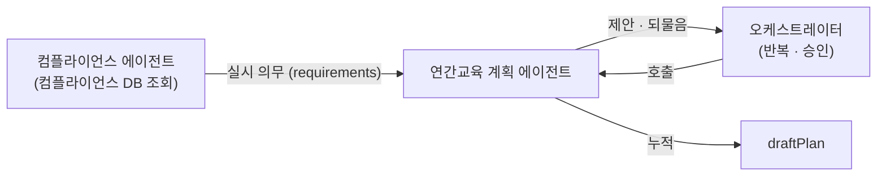
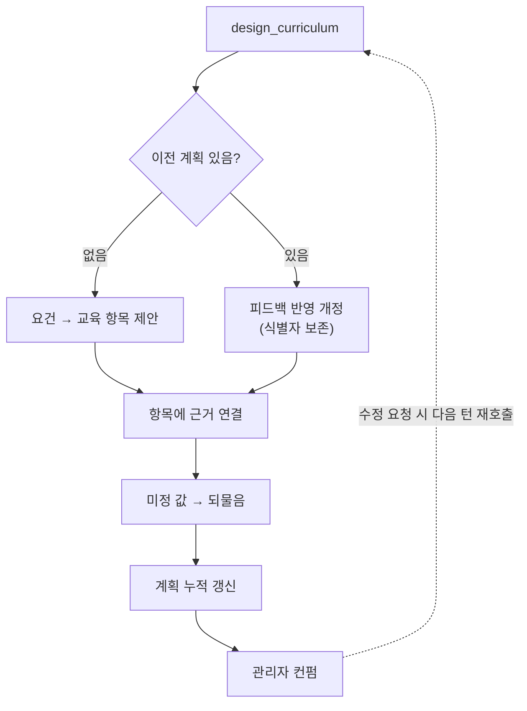

# 연간교육 계획 에이전트

> 관리자와 대화하며 한 해의 교육 커리큘럼을 설계합니다.

관리자가 올해 어떤 교육을 누구에게 할지 정할 때 쓰입니다. [컴플라이언스 에이전트](./compliance.md)가 조회한 실시 의무(팀의 교육 목록·주기·법정시간)를 받아 교육 항목 목록(`AnnualPlan`)을 제안하고, 관리자 피드백을 여러 차례 반영해 다듬습니다.

* [동작](#how) 제안 → 개정을 관리자 승인까지 반복
* [입력과 출력](#io) 슬롯과 타입
* [흐름](#flow) 한 번의 호출 순서

## 동작 {#how}

진입점 `design_curriculum`은 **한 번의 대화 턴마다 한 번 호출**됩니다. 호출 시점에 계획이 이미 있는지에 따라 두 모드로 동작합니다.

| 모드 | 조건 | 동작 |
| :-- | :-- | :-- |
| 초기 제안 | 이전 계획 없음 | 요건에서 교육 항목(`EducationPlanItem`)을 만들어 제안 |
| 개정 | 계획 있음 | 피드백을 반영해 항목을 추가·삭제·수정 (식별자 보존) |

각 항목은 근거에 연결되며, 아직 정하지 못한 값(강사·교육 시간)은 **되물음**으로 관리자에게 묻습니다. 계획은 매 턴 누적·수렴하며, 관리자가 승인하면 종료합니다.

## 입력과 출력 {#io}

| 방향 | 슬롯 | 타입 | 설명 |
| :-- | :-- | :-- | :-- |
| 입력 | `requirements` | `TrainingRequirement[]` | 컴플라이언스가 조회한 실시 의무 (교육·주기·법정시간) |
| 입력 | `draftPlan` | `AnnualPlan?` | 직전까지 다듬어진 계획 (첫 턴은 없음) |
| 입력 | `messages` | — | 이번 턴의 관리자 발화 |
| 출력 | `draftPlan` | `AnnualPlan` | 갱신된 계획 (누적) |

각 `EducationPlanItem`은 대상자군·교육 대분류·근거·교육 시간·교육 방법·평가 방법으로 구성됩니다.

## 흐름 {#flow}

:::note[설계 메모]

- 미정 항목(강사·교육 시간)은 실패가 아니라 정상입니다. 되물음으로 다음 턴에 채웁니다.
- 교육 대분류·교육 방법·평가 방법은 정해진 목록(기준정보)에서 고릅니다.
- 각 항목의 근거는 `requirements`의 `basis`에서 연결합니다(별도 문서 검색 없음).
- 교육 항목의 제안·개정은 LLM(gpt-4o)으로 수행합니다. 컴플라이언스 DB는 직접 조회하지 않으며, 실시 의무는 컴플라이언스 에이전트가 조회해 `requirements`로 전달합니다.
- 종료는 관리자 승인 시점이며, 결재(팀장·본부장)는 이 흐름 밖이며 백엔드가 담당합니다.

:::

## 관련 문서 {#see-also}

* [컴플라이언스 에이전트](./compliance.md) — 실시 의무를 조회하는 선행 단계
* [교육 컨텐츠 생성 에이전트](./content_generation.md) — 계획의 각 교육으로 콘텐츠를 생성
* [연간 교육계획 수립 시나리오](../scenarios/annual-plan.md)
