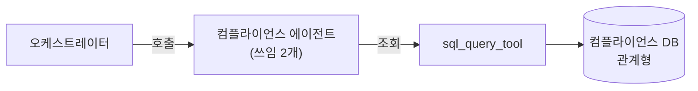
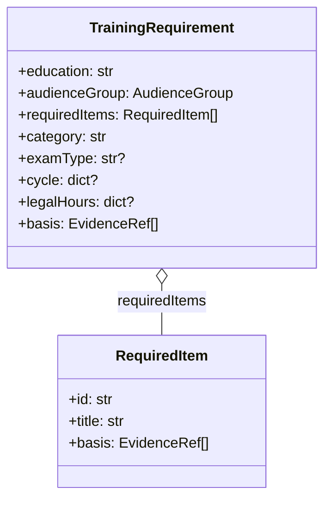
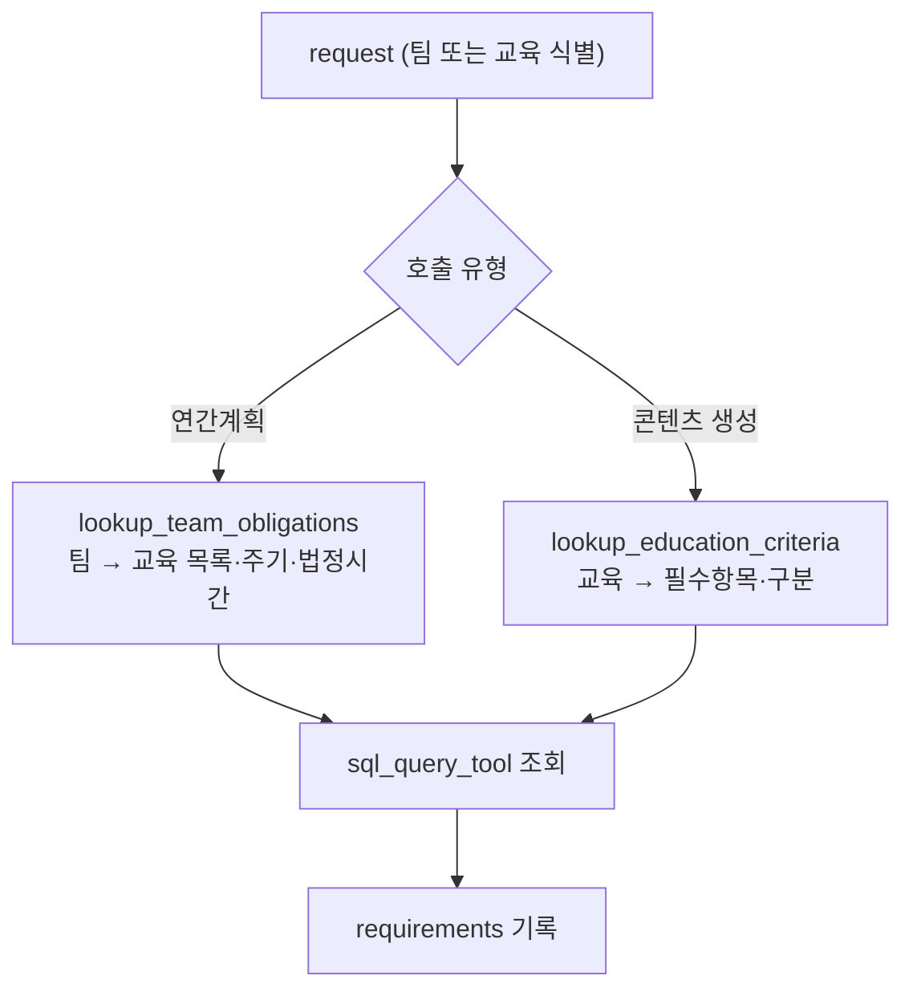

# 컴플라이언스 에이전트

> [컴플라이언스 DB](../data/compliance-db.md)에서 교육 의무와 기준을 조회합니다. 두 쓰임, 입력·출력, 처리 흐름을 다룹니다.

각 팀이 실시해야 할 교육의 **실시 의무**와 각 교육의 **기준**을 [컴플라이언스 DB](../data/compliance-db.md)(관계형)에서 조회합니다. 

* [동작](#how) 실시 의무 · 교육 기준 조회
* [입력과 출력](#io) 슬롯과 타입
* [흐름](#flow) 조회 시퀀스

## 동작 {#how}

컴플라이언스 DB는 **교육 기준**과 **실시 의무**를 담습니다. 교육 기준은 교육이 다뤄야 할 필수항목·근거·구분(법정/절차/법정외)·시험유형이며 팀과 무관합니다. 실시 의무는 어떤 팀이 어떤 교육을 어떤 주기·법정시간으로 실시하는지입니다.

| 쓰임 | 호출 | 가져오는 것 |
| :-- | :-- | :-- |
| 연간 교육계획 | `lookup_team_obligations` | 팀이 실시해야 할 교육 목록과 주기·법정시간·근거 |
| 교육 콘텐츠 생성 | `lookup_education_criteria` | 한 교육의 필수항목·구분·근거 (교육 메타는 `team_obligations`에서) |

교육과 문서를 잇는 매핑은 여기 없습니다. 어떤 문서를 참고할지는 [교육자료 저장소](../data/content-repository.md)의 라우터 레이어가 담당합니다.

## 입력과 출력 {#io}

| 방향 | 슬롯 | 타입 | 설명 |
| :-- | :-- | :-- | :-- |
| 입력 | `request` | `dict` | 연간계획: 팀(`orgScope`) / 콘텐츠 생성: 교육 식별(`eduId`) |
| 출력 | `requirements` | `TrainingRequirement[]` | 조회한 교육 기준·실시 의무 |

`TrainingRequirement`는 교육·대상자군과 함께 필수항목(`requiredItems`)·근거(`basis`)·구분(`category`)·시험유형(`examType`), 그리고 실시 의무의 주기·법정시간을 담습니다.

## 흐름 {#flow}

DB에 없는 팀·교육은 누락으로 표시하고 진행을 막습니다.

:::note[설계 메모]

- 교육과 문서의 매핑은 [교육자료 저장소](../data/content-repository.md)의 라우터 레이어가 담당합니다.
- 구분(법정/절차/법정외)·시험유형은 백엔드 기준정보와 맞춥니다.

:::

## 관련 문서 {#see-also}

* [컴플라이언스 DB](../data/compliance-db.md) — 조회 대상 데이터
* [교육자료 전처리 에이전트](./content_preprocess.md) — 필수항목을 실제 내용으로 채움
* [연간교육 계획 에이전트](./annual_plan.md) — 실시 의무로 연간계획 구성
