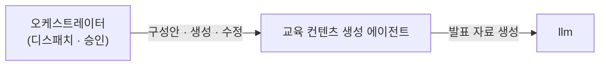
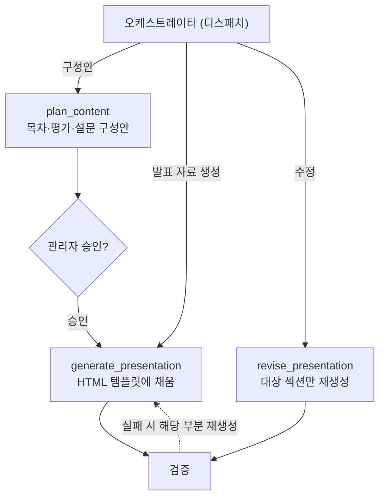

# 교육 컨텐츠 생성 에이전트

> 교육 자료로 발표 구성안을 작성하고, 승인된 구성안으로 발표 자료를 생성합니다.

[교육자료 전처리 에이전트](./content_preprocess.md)가 만든 **교육 자료**(`educationMaterial`)를 받아 **발표 구성안**(`plan`)을 작성하고, 승인된 구성안으로 **발표 자료**(`presentation`)를 생성합니다. 발표 자료는 NData가 제공하는 HTML 템플릿에 콘텐츠를 채워 만듭니다. 수정 요청 시 해당 섹션만 재생성합니다.

* [동작](#how) 구성안 → 승인 → 발표 자료
* [입력과 출력](#io) 슬롯과 타입
* [흐름](#flow) 세 가지 쓰임

## 동작 {#how}

| 호출 | 쓰임 | 동작 |
| :-- | :-- | :-- |
| `plan_content` | 콘텐츠 생성 (구성안) | 교육 자료에서 목차·평가·설문 구성안을 만듭니다 |
| `generate_presentation` | 콘텐츠 생성 (발표 자료) | 승인된 구성안으로 발표 자료를 생성합니다 |
| `revise_presentation` | 수정 | 지정된 섹션만 다시 생성합니다 (식별자 보존) |

구성안을 작성해 관리자 승인을 거친 뒤 발표 자료를 생성합니다. 구성안에는 시험·설문 계획이 포함되며, [시험 문제 생성 에이전트](./exam_generation.md)가 같은 구성안으로 문항을 생성합니다. 모든 섹션과 문항은 교육 자료의 근거에 연결됩니다.

## 입력과 출력 {#io}

| 방향 | 슬롯 | 타입 | 설명 |
| :-- | :-- | :-- | :-- |
| 입력 | `educationMaterial` | `EducationMaterial` | 전처리가 구성한 교육 자료 |
| 입력 | `plan` | `ContentPlan` | (발표 자료·수정) 승인된 구성안 |
| 출력 | `plan` | `ContentPlan` | 목차·평가 계획·설문 계획 |
| 출력 | `presentation` | `Presentation` | NData HTML 템플릿에 채운 발표 자료 |

`Presentation`의 각 발표 섹션은 교육 자료의 근거를 승계합니다.

## 흐름 {#flow}

생성·수정 결과는 [요건 검사 에이전트](./requirement_check.md)의 검증을 거치고, 근거가 빠지거나 요건과 어긋나면 해당 부분만 다시 생성합니다.

:::note[설계 메모]

- 발표 자료는 NData HTML 템플릿에 콘텐츠를 채우는 형태입니다(템플릿은 NData 소유).
- 입력 `educationMaterial`(교육 자료)와 출력 `presentation`(발표 자료)은 다른 산출물입니다.
- 평가를 필기시험으로 단정하지 않습니다. 교육 유형(교육·훈련)에 따라 형태가 갈립니다.
- 수정은 지정된 섹션만 다시 생성하며, 보존되는 섹션의 식별자는 바뀌지 않습니다.

:::

## 관련 문서 {#see-also}

* [교육자료 전처리 에이전트](./content_preprocess.md) — 입력 교육 자료를 구성
* [시험 문제 생성 에이전트](./exam_generation.md) — 같은 구성안으로 시험·설문 생성
* [요건 검사 에이전트](./requirement_check.md) — 생성물 근거 검증
* [교육 콘텐츠 생성 시나리오](../scenarios/content-generation.md)
