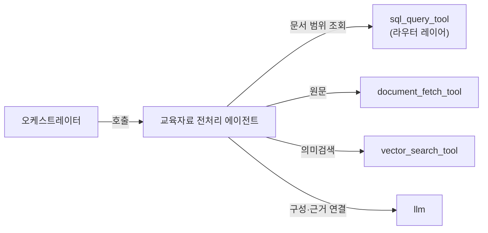
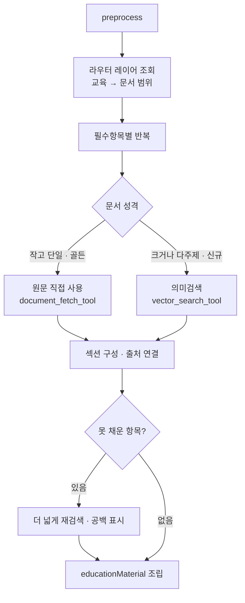

# 교육자료 전처리 에이전트

> 컴플라이언스가 정한 필수항목을, [교육자료 저장소](../data/content-repository.md)에서 실제 내용으로 채워 교육 컨텐츠 및 시험 문제 제작을 위한 전처리된 교육 자료용 문서를 만듭니다.

컴플라이언스 에이전트가 조회한 **필수항목**을 실제 내용으로 채웁니다. 먼저 [교육자료 저장소](../data/content-repository.md)의 **라우터 레이어**에서 그 교육의 문서 범위를 받고, 그 범위 안에서 **자료 레이어**의 내용을 가져와 교육 자료(`educationMaterial`)로 구성합니다. 어떤 문서를 쓸지는 라우터가 정하고, 본 에이전트는 그 범위 안에서 내용을 가져옵니다.

* [동작](#how) 범위 확보 → 내용 확보 → 구성
* [입력과 출력](#io) 슬롯과 타입
* [흐름](#flow) 항목별 내용 확보 분기

## 동작 {#how}

| 단계 | 동작 | 도구 |
| :-- | :-- | :-- |
| 문서 범위 확보 | 라우터 레이어에서 그 교육에 매핑된 문서 목록·메타를 조회 | `sql_query_tool` |
| 항목별 내용 확보 | 범위 내 문서에서 필수항목별 내용을 가져옴 | `document_fetch_tool` · `vector_search_tool` |
| 구성·근거 연결 | 가져온 내용을 필수항목 축으로 섹션을 구성하고 출처(`docId`)를 연결 | `llm` |
| 공백 점검 | 못 채운 항목은 더 넓게 재검색하거나 공백으로 표시 | |

내용 확보는 문서 성격으로 갈립니다.

- **원문 직접 사용** ([`document_fetch_tool`](../tools/document-fetch-tool.md)) — 문서가 작고 단일 주제이거나 라우터가 골든 문서로 지정한 경우. 검색 없이 본문을 그대로 씁니다.
- **의미검색** ([`vector_search_tool`](../tools/vector-search-tool.md)) — 문서가 크거나 여러 주제가 섞였을 때. 필수항목별로 관련 조각만 꺼냅니다. 매핑이 없는 신규 교육은 전체에서 검색합니다.

검색은 라우터 범위로 하드필터한 뒤 수행하며, 가져온 조각은 출처(`docId`)를 함께 보유합니다.

## 입력과 출력 {#io}

| 방향 | 슬롯 | 타입 | 설명 |
| :-- | :-- | :-- | :-- |
| 입력 | `requirements` | `TrainingRequirement[]` | 컴플라이언스가 준 교육 기준 (필수항목 포함) |
| 입력 | `request` | `dict` | 교육 식별(`eduId`) |
| 출력 | `educationMaterial` | `EducationMaterial` | 필수항목을 채운 교육 자료 |

`EducationMaterial`은 필수항목별 섹션(`sections`)과 요약으로 구성되며, 각 섹션은 출처(`EvidenceRef`)에 연결됩니다.

## 흐름 {#flow}

:::note[설계 메모]

- 교육↔문서 매핑은 라우터 레이어가 정합니다. 본 에이전트는 그 범위 안에서 내용을 가져옵니다.
- 원문 직접 사용을 우선하고, 의미검색은 문서가 크거나 다주제·신규일 때 씁니다.
- 검색은 라우터 범위로 하드필터한 뒤 수행하며, 조각은 출처(`docId`)를 보유합니다.

:::

## 관련 문서 {#see-also}

* [교육자료 저장소](../data/content-repository.md) — 라우터·자료 레이어
* [컴플라이언스 에이전트](./compliance.md) — 필수항목을 조회하는 선행 단계
* [교육 컨텐츠 생성 에이전트](./content_generation.md) — 교육 자료로 발표 자료 생성
* [요건 검사 에이전트](./requirement_check.md) — 필수항목 커버리지 검증
