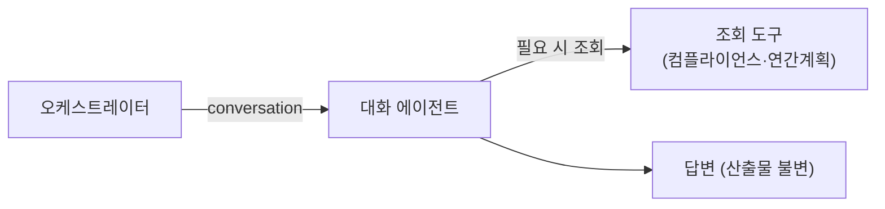

# 대화 에이전트

> 오케스트레이터가 **대화/조회**로 보낸 발화를 처리합니다. 전체 대화 이력을 보고, 필요하면 조회 도구로 답합니다. (읽기 전용)

대화 에이전트는 사용자와 자연스럽게 대화하며, 업무 범위(연간 교육계획·교육자료·시험/평가·산출물 수정)에 관한 **질문·조회·확인**에 답합니다. 콘텐츠를 직접 만들거나 수정하지 않습니다 — 그건 시나리오 에이전트의 몫이고, 사용자가 무언가 만들길 원하면 "만들어 드릴까요?"로 다음 단계를 안내합니다.

* [동작](#how) · [[참고] 컨텍스트](#note)
* [입력과 출력](#io)

## 동작 {#how}

- **전체 이력 참조**: 매 턴 전체 대화(`state.messages`)를 그대로 봅니다. 작업을 사이에 둔 회상("아까 뭐랬지?")이 끊기지 않습니다.
- **필요할 때만 조회**: 답하는 데 사실이 필요하면 조회 도구를 부릅니다. 이미 [참고]에 있는 정보면 다시 조회하지 않습니다.
- **지어내지 않음**: 조회 결과가 없으면 "없다"고 분명히 말하고 다음 행동(예: "만들어 드릴까요?")을 안내합니다.

조회 도구는 컴플라이언스 조회 + 작성된 연간계획 조회입니다(읽기 전용). 한 턴 도구 호출 수는 제한됩니다.

## [참고] 컨텍스트 {#note}

매 턴, 변하지 않는 시스템 프롬프트 뒤에 **[참고] 쪽지**를 붙입니다. 사용자 정보(이름·팀·id), 오늘 날짜, 현재 보유 산출물 요약, 직전 조회 결과가 들어갑니다.

- 조회 도구 호출엔 **id**를 쓰고, 사용자에게 보이는 답에는 코드 대신 **이름**으로 답합니다.
- 직전 조회 결과를 [참고]에 텍스트로 실어 **재조회를 막습니다**(조회 결과는 내부 스레드 `convo_thread`에 누적).

## 입력과 출력 {#io}

| 방향 | 슬롯 | 타입 | 설명 |
| :-- | :-- | :-- | :-- |
| 입력 | `messages` | — | 전체 대화 이력 + 이번 발화 |
| 입력 | `state` | `State` | 보유 산출물·컨텍스트 |
| 출력 | `messages` | — | 답변(assistant) 1건 누적 |
| 출력 | `convo_thread` | — | 이번 턴 조회 결과(내부 메모리) |

:::note[설계 메모]

- 읽기 전용입니다. 콘텐츠 생성·수정은 시나리오 에이전트가 합니다.
- 대화는 전체 이력(요약 X)으로 봅니다. 큰 산출물은 [참고]에 규모만, 작은 데이터(연간계획 등)는 핵심까지 실어 재조회를 줄입니다.
- 표시용 대화(`messages`)와 내부 도구결과(`convo_thread`)는 분리합니다 — 프론트엔 `messages`만 노출.

:::

## 관련 문서 {#see-also}

* [오케스트레이터](./orchestrator.md) — 발화를 대화/작업으로 라우팅
* [에이전트 플로우](../scenarios/agent-flow.md)
