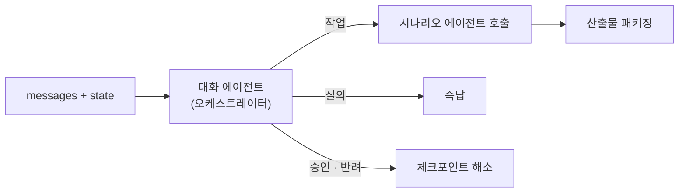
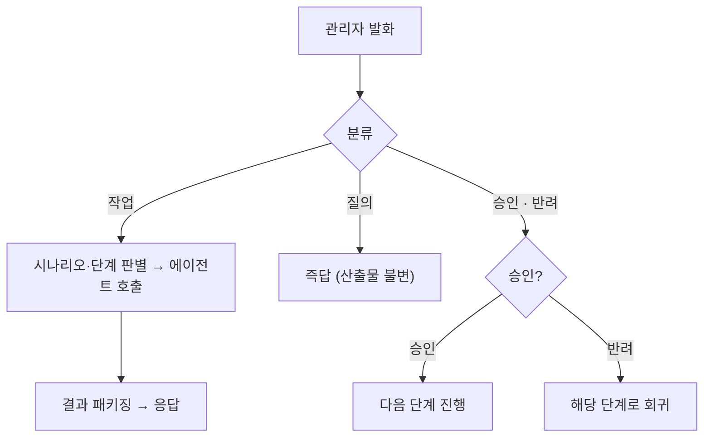

# 대화 에이전트 (오케스트레이터)

> 매 턴 관리자 입력을 분류해 알맞은 시나리오·응답으로 보내고, 산출물을 패키징합니다. 모든 시나리오에 걸치는 상시 처리입니다.

대화 에이전트는 시스템의 **오케스트레이터**입니다. 매 대화 턴마다 관리자 입력을 분류해(작업 / 질의 / 승인) 알맞은 에이전트나 응답으로 라우팅하고, 휴먼 체크포인트(승인·반려)를 해소하며, 완료된 산출물을 응답으로 패키징합니다. 특정 시나리오에 속하지 않고 네 시나리오 전부에 겹치는 상시(cross-cutting) 처리입니다.

* [동작](#how) 입력 분류 → 라우팅
* [입력과 출력](#io) 슬롯과 타입
* [흐름](#flow) 한 턴의 처리

## 동작 {#how}

매 턴 입력을 세 가지로 분류합니다.

| 분류 | 의미 | 처리 |
| :-- | :-- | :-- |
| 작업(task) | 생성·수정·채점 등 요청 | 해당 시나리오 에이전트를 호출 |
| 질의(query) | 정보 요청 | 즉답 (산출물 불변) |
| 승인 · 반려 | 체크포인트 해소 | 다음 단계 진행 또는 회귀 |

분류는 LLM으로 수행합니다. 작업으로 분류되면 어떤 시나리오·단계인지 판별해 호출하고, 결과를 응답으로 패키징합니다. 승인 전에는 다음 단계로 넘어가지 않습니다(휴먼 체크포인트).

## 입력과 출력 {#io}

| 방향 | 슬롯 | 타입 | 설명 |
| :-- | :-- | :-- | :-- |
| 입력 | `messages` | — | 이번 턴의 관리자 발화 |
| 입력 | `state` | `State` | 현재까지의 공유 상태 |
| 출력 | `routing` | `dict` | 분류 결과와 호출 대상 |
| 출력 | `data` | `dict` | 응답 패키지 (즉답 또는 산출물) |

무상태로 동작합니다. 매 호출은 `messages`와 `state`로 구성하며, 상태는 호출자가 보관합니다. 체크포인트는 호출 분리로 구현합니다.

## 흐름 {#flow}

:::note[설계 메모]

- 질의·승인은 시나리오가 아니라 모든 시나리오에 겹치는 상시 처리입니다.
- 입력 분류는 LLM으로 수행합니다. 데이터 계층은 직접 조회하지 않고, 호출한 시나리오 에이전트가 접근합니다.
- 휴먼 체크포인트는 호출 분리로 구현합니다. 승인 전 다음 단계·배포를 금지합니다.

:::

## 관련 문서 {#see-also}

* [에이전트 플로우](../scenarios/agent-flow.md) — 대화 에이전트가 라우팅하는 시나리오 개요
* [수정과 재생성](../scenarios/revision.md) — 수정 대상 식별을 대화 에이전트가 수행
