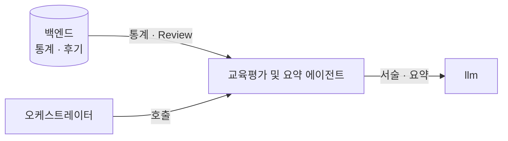
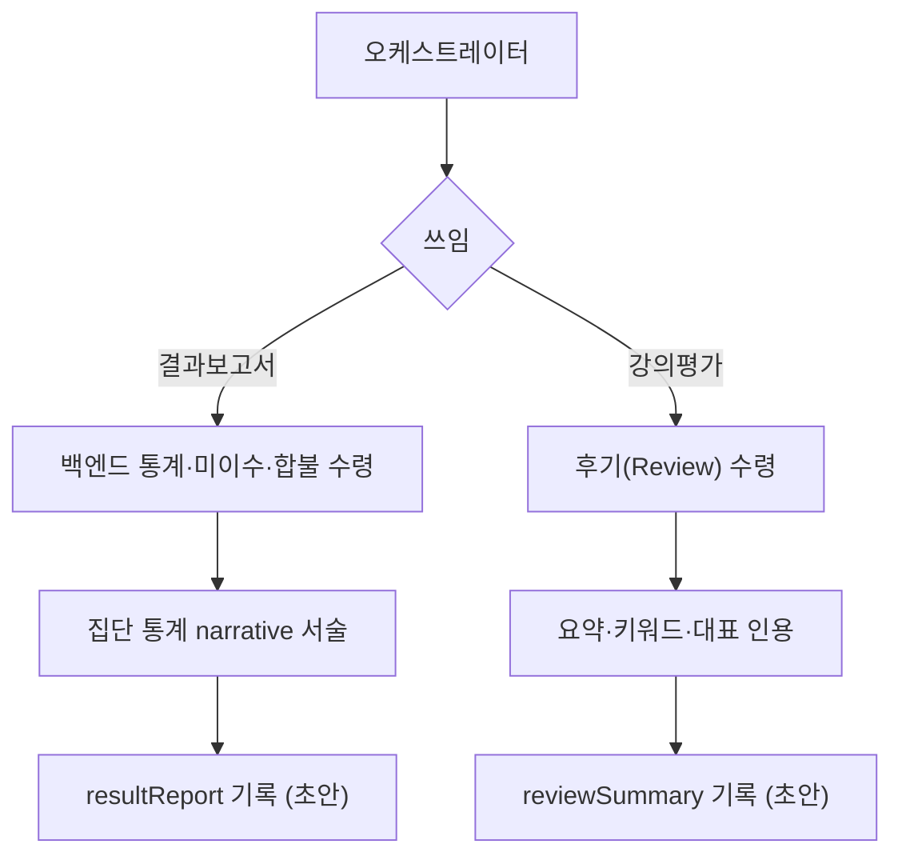

# 교육평가 및 요약 에이전트

> 백엔드 통계로 결과보고서 초안을 쓰고, 수강자 후기를 종합합니다.

두 가지 쓰임이 있습니다. **결과보고서**는 백엔드가 집계한 시험 결과 통계로 관리자용 집단 통계 보고서를 서술합니다. **강의평가 종합**은 수강자 후기를 종합해 요약·키워드를 만듭니다. 둘 다 통계·판정을 직접 계산하지 않고, 백엔드가 산출한 값을 받아 서술합니다.

* [동작](#how) 결과보고서 · 강의평가 종합
* [입력과 출력](#io) 슬롯과 타입
* [흐름](#flow) 두 트랙

## 동작 {#how}

| 쓰임 | 호출 | 동작 |
| :-- | :-- | :-- |
| 결과보고서 | `summarize_result` | 백엔드 통계·미이수자·합불로 집단 통계 보고서를 서술 |
| 강의평가 종합 | `summarize_reviews` | 수강자 후기(별점·자유 서술)를 종합해 요약·키워드·대표 인용 |

결과보고서는 개인 결과가 아니라 **관리자용 집단 통계**입니다(점수 분포·합격률·미이수 현황). 통계 수치·합불·미이수 판정은 백엔드가 산출하고, 본 에이전트는 받은 값을 서술합니다. 강의평가 종합은 채점과 별개 트랙입니다.

## 입력과 출력 {#io}

| 방향 | 슬롯 | 타입 | 설명 |
| :-- | :-- | :-- | :-- |
| 입력 | `resultStats` | `ResultStats` | (결과보고서) 백엔드 시험 결과 통계 |
| 입력 | `completionGap` | `CompletionGap` | (결과보고서) 미이수자 |
| 입력 | `reviews` | `Review[]` | (강의평가) 수강자 후기 |
| 출력 | `resultReport` | `ResultReportDraft` | 결과보고서 초안 |
| 출력 | `reviewSummary` | `ReviewSummary` | 강의평가 종합 |

`Review`는 백엔드 스키마(별점 + 자유 서술)를 따릅니다. 강의평가 종합은 백엔드 후기요약 기능과 대응하며, 본 에이전트는 요약 본문·키워드를 산출하고 저장은 백엔드가 합니다.

## 흐름 {#flow}

산출물은 초안이며, 배포 전 관리자 확인을 거칩니다.

:::note[설계 메모]

- 통계 수치·합불·미이수 판정은 백엔드가 산출합니다. 본 에이전트는 받은 값을 서술만 합니다.
- 결과보고서는 개인 결과가 아니라 관리자용 집단 통계입니다.
- 시험과 강의평가는 다릅니다. 시험은 지식 채점(시험 문제 에이전트), 강의평가는 교육 피드백 종합입니다.

:::

## 관련 문서 {#see-also}

* [시험 문제 에이전트](./exam_generation.md) — 채점을 수행하는 선행 단계
* [채점과 결과보고서 시나리오](../scenarios/grading-report.md)
