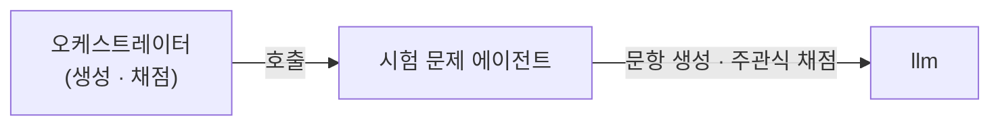
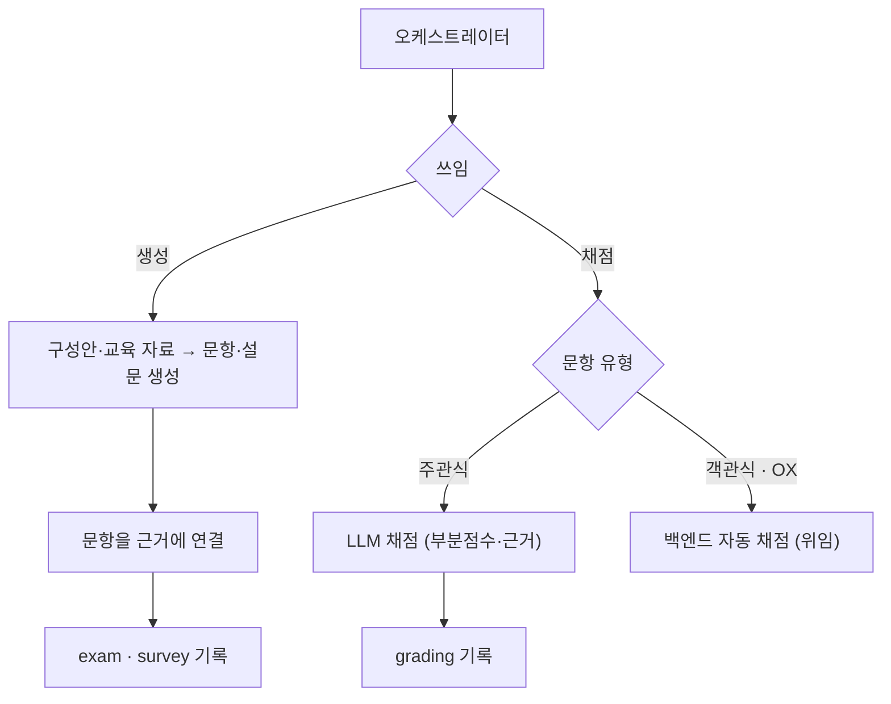

# 시험 문제 에이전트

> 승인된 구성안으로 시험 문항과 강의평가 설문을 생성하고, 응시 후 주관식 답안을 채점합니다.

두 가지 쓰임이 있습니다. **생성**은 [교육 컨텐츠 생성 에이전트](./content_generation.md)가 만든 구성안과 교육 자료로 시험 문항·강의평가 설문을 만듭니다. **채점**은 응시 답안 중 주관식만 LLM으로 채점합니다. 객관식 자동 채점과 합불·총점 판정은 백엔드가 담당합니다.

* [동작](#how) 생성 · 채점
* [입력과 출력](#io) 슬롯과 타입
* [흐름](#flow) 두 쓰임의 처리

## 동작 {#how}

| 쓰임 | 호출 | 동작 |
| :-- | :-- | :-- |
| 생성 (콘텐츠 생성) | `generate` | 구성안·교육 자료로 문항(`ExamSheet`)과 강의평가 설문(`Survey`)을 생성 |
| 채점 (결과 정리) | `grade` | 주관식 답안을 LLM으로 채점 |

생성한 문항은 백엔드 `Question` 스키마를 따릅니다(객관식·OX·주관식 등 유형 다양). 각 문항은 교육 자료의 근거에 연결됩니다. 채점은 주관식(`SUBJECTIVE`)만 LLM으로 수행하고, 객관식·OX는 백엔드 규칙(`AUTO`)에 위임합니다. 합불·총점은 백엔드가 판정합니다.

## 입력과 출력 {#io}

| 방향 | 슬롯 | 타입 | 설명 |
| :-- | :-- | :-- | :-- |
| 입력 | `plan` | `ContentPlan` | (생성) 승인된 구성안 (시험·설문 계획 포함) |
| 입력 | `educationMaterial` | `EducationMaterial` | (생성) 근거 연결용 교육 자료 |
| 입력 | `examResults` | `ExamResult[]` | (채점) 응시 답안 |
| 출력 | `exam` | `ExamSheet` | 생성한 시험 (문항·정답·해설·근거) |
| 출력 | `survey` | `Survey` | 강의평가 설문 |
| 출력 | `grading` | `GradingResult[]` | 주관식 채점 결과 |

`Question`은 백엔드 스키마를 따릅니다(유형·정답/채점기준·근거). 채점 결과는 백엔드 답안 레코드에 점수와 채점 주체(`gradedBy=LLM`)만 회신합니다.

## 흐름 {#flow}

:::note[설계 메모]

- 시험지 조립·합불·총점·이수 판정은 백엔드가 합니다. 본 에이전트는 문항 초안과 주관식 채점만 산출합니다.
- 평가를 필기시험으로 단정하지 않습니다. 평가 방법이 필기시험이 아니면(실습·면담 등) 채점 단계가 비어 있을 수 있습니다.
- 신뢰도가 낮은 주관식 채점은 사람 검토 대상으로 표시합니다.
- 시험과 강의평가 설문은 별개입니다. 시험은 지식 채점, 설문은 교육 피드백입니다.

:::

## 관련 문서 {#see-also}

* [교육 컨텐츠 생성 에이전트](./content_generation.md) — 같은 구성안으로 발표 자료 생성
* [교육평가 및 요약 에이전트](./eval_survey_summary.md) — 채점 결과로 결과보고서 작성
* [교육 콘텐츠 생성 시나리오](../scenarios/content-generation.md) · [채점과 결과보고서 시나리오](../scenarios/grading-report.md)
