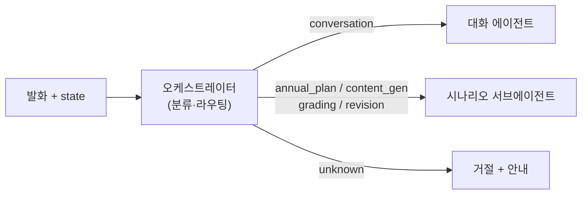
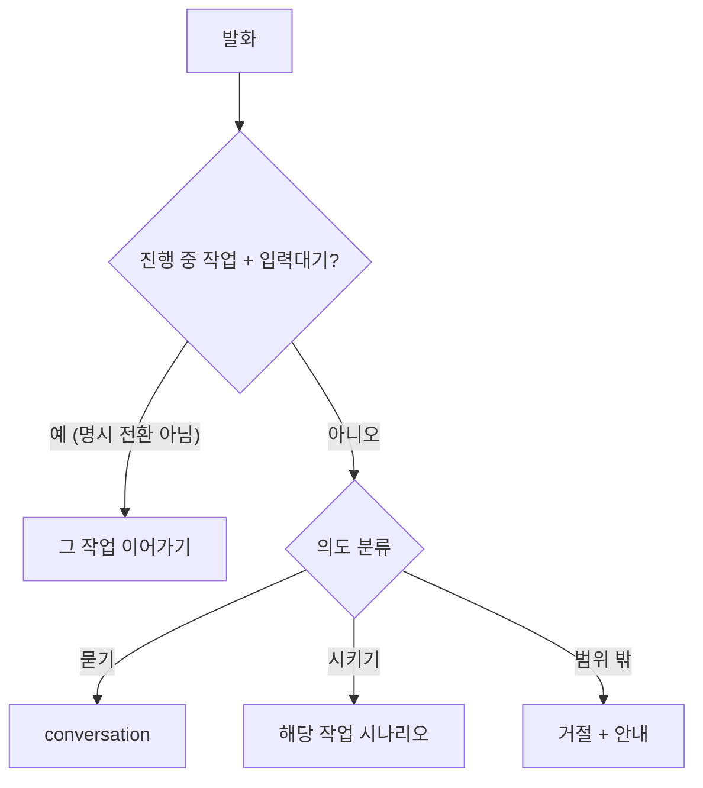

# 오케스트레이터 에이전트 (라우터)

> 매 턴 사용자 발화를 읽어 **어디로 보낼지** 정합니다. 직접 일하지 않고 분류·라우팅만 합니다.

오케스트레이터는 대화 시스템의 **입구**입니다. 매 턴 발화를 분류해 — 대화로 답할지, 아니면 어떤 작업(시나리오) 에이전트를 호출할지 — 결정합니다. 데이터를 직접 조회하거나 산출물을 만들지 않습니다(그건 [대화 에이전트](./conversation.md)·시나리오 에이전트의 몫).

* [동작](#how) 분류 → 라우팅
* [수정 대상 식별](#identify-revision)
* [입력과 출력](#io) · [흐름](#flow)

## 동작 {#how}

LLM으로 발화의 **의도**를 분류합니다. 표면 단어가 아니라 "묻는 것이냐, 시키는 것이냐"를 봅니다.

| 분류 | 의미 | 라우팅 |
| :-- | :-- | :-- |
| `conversation` | 묻기·조회·확인·논의 | 대화 에이전트 |
| `annual_plan` | 연간 교육계획 작성 지시 | 연간계획 시나리오 |
| `content_gen` | 교육자료(발표·시험·설문) 생성 지시 | 콘텐츠 생성 시나리오 |
| `grading` | 채점·결과보고 지시 | 채점·결과 시나리오 |
| `revision` | 기존 산출물 수정 지시 | 수정 시나리오 |
| `unknown` | 업무 범위 밖 | 정중히 거절 + 안내 |

- **묻기 vs 시키기**: "있어?/뭐야?/어때?"는 conversation. "만들자/짜줘/진행해"처럼 **착수를 분명히 지시**할 때만 작업으로 보냅니다. 모호하면 conversation으로 둬 대화로 더 파악합니다.
- **이어가기(sticky)**: 진행 중 작업(`active_scenario`)이 있고 입력 대기 중이면, 사용자가 **명시적으로 다른 작업으로 바꾸려 할 때만** 전환하고, 그 외(값 보완·다듬기)는 그 작업을 이어갑니다.
- **산출물 선택(content_gen)**: 발표자료/시험/설문 중 사용자가 말한 것만 고릅니다. 안 밝히면 기본=발표자료만.
- **결재/승인 분류는 없습니다** — 승인 흐름은 백엔드(USHE 절차)가 담당합니다.

세션 첫 진입에는 LLM 없이 **환영 멘트(GREETING)**를, 범위 밖 요청에는 고정 **거절·안내 멘트**를 돌려줍니다.

## 수정 대상 식별 {#identify-revision}

수정(`revision`) 시나리오 진입 시, 오케스트레이터가 발화를 읽어 **어느 산출물의 어느 요소**(슬라이드·문항)를 고칠지 식별합니다. 산출물이 없거나 대상을 못 짚으면 거부하고 되묻습니다.

## 입력과 출력 {#io}

| 방향 | 슬롯 | 타입 | 설명 |
| :-- | :-- | :-- | :-- |
| 입력 | `messages` | — | 이번 턴 발화 |
| 입력 | `state` | `State` | 공유 상태(진행 중 작업 포함) |
| 출력 | `current_scenario` | `str?` | 라우팅된 시나리오(또는 `conversation`) |
| 출력 | `active_scenario` · `awaiting` | — | 이어가기·입력대기 신호 |

## 흐름 {#flow}

:::note[설계 메모]

- 오케스트레이터는 **라우팅만** 합니다. 데이터 조회·생성은 대화/시나리오 에이전트가 합니다.
- 분류는 발화 의도 중심입니다. 멀티턴 논의 끝의 "만들자"를 옳게 보내려면 대화 이력 맥락이 필요합니다.
- 결재/승인은 시스템 밖(백엔드) 처리입니다.

:::

## 관련 문서 {#see-also}

* [대화 에이전트](./conversation.md) — `conversation`으로 라우팅된 발화를 처리
* [에이전트 플로우](../scenarios/agent-flow.md) — 라우팅되는 시나리오 개요
* [수정과 재생성](../scenarios/revision.md) — 수정 대상 식별
