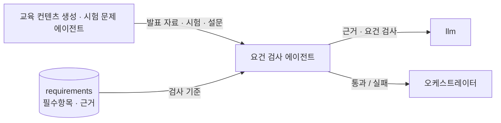
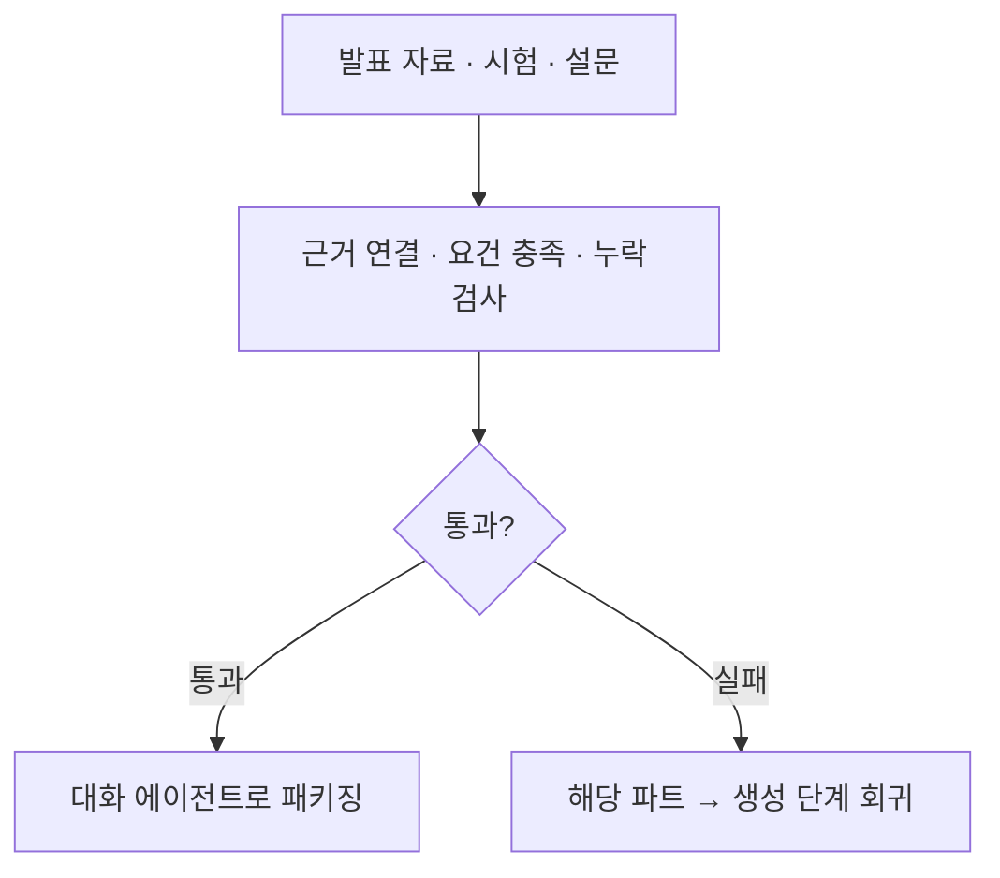

# 요건 검사 에이전트

> 생성·수정한 산출물이 근거에 연결되고 요건을 충족하는지 종합 검증합니다.

[교육 컨텐츠 생성 에이전트](./content_generation.md)와 [시험 문제 에이전트](./exam_generation.md)가 만든 산출물(발표 자료·시험·설문)을 받아, 근거 연결·요건 충족·누락을 검사합니다. 어긋나면 해당 부분만 다시 생성하도록 돌려보냅니다. 모듈별로 흩어진 검사가 아니라 산출물 전반을 한 검증자가 종합 검사합니다.

* [동작](#how) 세 가지 검사
* [입력과 출력](#io) 슬롯과 타입
* [흐름](#flow) 검증 → 회귀

## 동작 {#how}

| 검사 | 보는 것 |
| :-- | :-- |
| 근거 연결 (grounding) | 모든 핵심 내용·문항이 근거 문서에 연결됐는지 |
| 요건 충족 | 필수항목을 빠짐없이 다뤘는지, 구분·시험유형이 요건과 맞는지 |
| 충돌 · 누락 | 근거와 어긋나거나 빠진 부분이 있는지 |

검사 결과는 `VerificationResult`(통과 여부 + 문제 목록)로 냅니다. 실패하면 해당 파트만 생성 단계로 회귀시킵니다.

## 입력과 출력 {#io}

| 방향 | 슬롯 | 타입 | 설명 |
| :-- | :-- | :-- | :-- |
| 입력 | `presentation` | `Presentation` | 검사 대상 발표 자료 |
| 입력 | `exam` · `survey` | `ExamSheet` · `Survey` | 검사 대상 시험·설문 |
| 입력 | `requirements` | `TrainingRequirement[]` | 필수항목·근거 (검사 기준) |
| 입력 | `educationMaterial` | `EducationMaterial` | 근거 대조용 교육 자료 |
| 출력 | `verification` | `VerificationResult` | 통과 여부와 문제 목록 |

`VerificationResult`는 근거 연결 여부·요건 충족 여부·누락 항목·통과 여부를 담습니다.

## 흐름 {#flow}

:::note[설계 메모]

- 모듈 분산이 아니라 산출물 전반을 한 검증자가 종합 검사합니다. "요건 파악·해석"은 컴플라이언스 에이전트가 담당합니다.
- 근거 필수 원칙: 교육 핵심·문항은 근거 문서에 연결돼야 합니다. 근거 없는 생성을 막습니다.
- 수정·재생성 시에는 바뀐 부분과 그 인접 영향까지 봅니다.

:::

## 관련 문서 {#see-also}

* [교육 컨텐츠 생성 에이전트](./content_generation.md) · [시험 문제 에이전트](./exam_generation.md) — 검사 대상 산출물 생성
* [교육 콘텐츠 생성 시나리오](../scenarios/content-generation.md) · [수정과 재생성 시나리오](../scenarios/revision.md)
