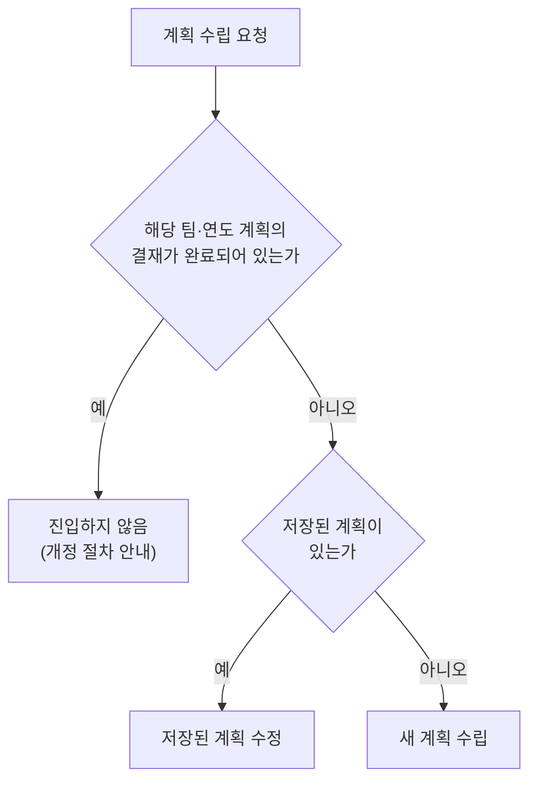

# 시작과 진입

탭이 계획 수립 요청을 받으면 팀과 연도를 기준으로 시작 방식을 판정합니다. 판정 결과는
새 계획 수립, 저장된 계획 수정, 일괄 생성의 세 경로 중 하나이며, 결재가 완료된 계획이
있는 팀은 어느 경로로도 진입하지 않고 개정 절차를 안내합니다.

## 진입 판정

요청에는 팀 식별자가 있어야 합니다. 없으면 화면에서 부서를 선택하도록 안내하고
진행하지 않습니다. 연도가 없으면 올해를 기준으로 합니다.

일괄 생성 호출은 같은 판정을 거치되, 저장된 계획이 있으면 수정으로 진입하는 대신 생성
대상이 아니라는 응답을 반환합니다. 이미 만들어 둔 계획을 덮어쓰지 않기 위한
동작입니다. 저장된 계획의 확인 자체가 실패하면 어느 경로로도 진행하지 않고 다시 시도를
안내합니다. 확인 없이 새로 시작하면 저장된 계획을 모르는 채 작업하게 되기 때문입니다.

## 새 계획 수립

저장된 계획이 없는 팀의 요청은 워크플로 1단계부터 시작합니다. 시스템이 팀에 매핑된
교육과정과 부서 정보(부서명·담당자)를 조회한 뒤, 계획 범위 질문을 제시합니다. 조회된
부서 담당자 이름은 이후 강사 질문의 기본값으로 쓰입니다.

## 저장된 계획 수정

결재 전 상태로 저장된 계획이 있는 팀의 요청은 그 계획을 불러와 바로 수정 단계로
진입합니다. 저장된 행의 값(회차, 시행월, 시간, 강사, 교육방법, 평가방법, 상세 내용)이
모두 복원되어 계획표로 제시되고, 담당자는 무엇이든 바로 수정할 수 있습니다.

설문 답은 저장 대상이 아니므로 복원되지 않습니다. 대신 새 설문 틀이 미답 상태로 함께
준비되어, 실시월 배정 방식이나 시간이 비어 있는 교육의 처리 같은 결정을 수정 중에 새로
내릴 수 있습니다. 저장된 계획이 법정 기준에 미달하는 상태라면 불러온 계획표에도 같은
경고가 표시됩니다.

저장된 계획을 버리고 처음부터 새로 만들려면 그 의사를 명시해야 합니다. "처음부터 다시
만들어줘" 같은 요청일 때만 새 계획 수립으로 진입하고, 단순한 수립 요청("계획 세워줘")은
저장된 계획이 있으면 항상 불러오기로 이어집니다.

| 담당자 입력 | 시스템 동작 |
|---|---|
| "올해 우리 팀 교육계획 수정하고 싶어요" | 저장된 계획을 불러와 계획표로 제시 |
| "정기교육 강사를 김서연으로 바꿔줘" | 값을 반영하고 바뀐 값을 보고 |
| "처음부터 다시 만들어줘" | 불러온 계획을 버리고 계획 범위 질문부터 새로 시작 |

## 일괄 생성

일괄 생성은 백엔드가 부서 목록을 돌며 대화 없이 호출하는 방식입니다. 설문을 운영
기본값 한 벌로 채우고, 목록·요약·계획표의 확인 단계 없이 생성과 요건 검사까지 한 번의
호출로 진행합니다. 기본값의 구성(계획 범위·회차·시간·교육방법·평가방법·강사)은 코드에
정의되어 있으며, 강사는 부서 정보의 담당자로 지정됩니다.

저장된 계획이 있는 부서는 건너뛰고 그 사실을 응답하므로, 같은 부서에 반복 호출해도
계획이 중복 생성되거나 덮어써지지 않습니다.

## 결재가 완료된 계획

해당 팀·연도 계획의 결재가 완료된 상태이면 수정과 재작성 모두 진입하지 않습니다.
확정·결재된 계획의 변경은 이 탭이 아니라 운영 시스템의 개정 절차가 담당하며, 응답에서
그 경로를 안내합니다.

## 코드 참조

| 구성 요소 | 코드 이름 | 모듈 경로 |
|---|---|---|
| 진입 판정과 시작 분기 | `AnnualIntakeAgent` | `src/tabs/annual_plan/intake/agent.py` |
| 저장된 계획 복원 | `restore_saved_plan` | `src/tabs/annual_plan/planner/restore.py` |
| 일괄 생성 기본값 | `build_auto_sheet` | `src/tabs/annual_plan/intake/auto.py` |
| 요청 분류·재시작 신호 | `AnnualTabOrchestrator` | `src/tabs/annual_plan/graph.py` |
