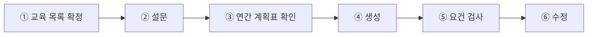

# 소개

연간 교육계획 탭은 교육 담당자가 **대화만으로** 팀의 한 해 교육 계획을 수립하고 수정하는
기능을 제공합니다. 계획은 어떤 교육을 몇 회로 나눠 몇 월에 몇 시간씩 실시하고, 교육방법과
평가방법, 강사를 어떻게 둘지의 결정 묶음이며, 회차 단위 행으로 구성됩니다. 계획의 뼈대는
백엔드에 등록된 팀별 교육 데이터에서 출발하고, 담당자는 질문에 답하며 결정을 채우거나
**세부 결정 전체를 기본값에 위임**할 수 있습니다.

## 워크플로

작업은 다음 여섯 단계로 진행됩니다. 교육자료 생성 탭과 달리 **단계 순서가 고정되어
있으며**, 교육 목록 확인·확정 요약·계획표 승인의 세 지점에서 담당자의 확인을 받은 뒤에만
다음 단계로 넘어갑니다. 다만 앞 단계에서 정한 내용의 수정은 어느 단계에서든 대화로 요청할
수 있습니다 — 생성이 끝난 뒤 교육을 추가하거나 회차를 바꾸면 새로 생긴 부분만 다시
생성됩니다.

1. **교육 목록 확정** — 팀에 매핑된 법정 교육 목록과 자율 교육 목록을 차례로 제시합니다.
   법정 목록은 주기가 정해진 교육과 채용·작업 변경 같은 상황이 생길 때 실시하는 수시
   교육으로 나뉘며, 수시 교육은 올해 실시 예정이 있을 때만 계획에 편성합니다. 어떤
   교육이든 빼거나 다시 넣거나 추가할 수 있고, 법정 교육을 빼는 경우 차단하지 않는 대신
   경고가 함께 표시됩니다.
2. **설문** — 계획 범위, 근로자 분류, 무재해 감면, 시간 분할, 실시월 배정 방식, 교육방법,
   평가방법, 강사의 여덟 가지 필수 질문에 답합니다. 교육 데이터와 법령 정보 어디에서도
   시간을 확인할 수 없는 교육이 있으면 그 처리를 묻는 질문이 추가됩니다. 답하지 않은
   항목은 카드에 표시된 기본값으로 진행되며, 마지막에 답 전체를 확정 요약으로 확인받습니다.
3. **연간 계획표 확인** — 설문 답과 교육 데이터로 회차 단위 계획표가 조립되어 제시됩니다.
   담당자가 승인해야 생성이 시작되며, 이 화면에서도 값과 구성을 수정할 수 있습니다.
4. **생성** — 계획표의 회차마다 상세 교육 내용을 생성합니다.
5. **요건 검사** — 완성된 계획을 검토해 법정 기준과 어긋나거나 계획 안에서 서로 맞지 않는
   값을 경고로 알립니다. 진행을 막지 않으며, 담당자가 직접 지시한 변경은 다시 지적하지
   않습니다.
6. **수정** — 값(시행월·시간·강사·교육방법·평가방법), 구성(교육 추가·제외 복원·회차 수),
   내용(회차 본문 재작성)을 대화로 수정합니다. 반영 결과는 변경 전후를 비교해 실제로
   바뀐 값만 보고됩니다.

## 시작 방식

탭에 진입하는 경로는 세 가지입니다.

- **새 계획 수립** — 저장된 계획이 없는 팀에서 계획 수립을 요청하면 워크플로 1단계부터
  시작합니다.
- **저장된 계획 수정** — 결재 전 상태로 저장된 계획이 있으면 그 계획을 불러와 바로 수정
  단계로 진입합니다. 결재가 완료된 계획은 이 탭에서 수정할 수 없으며 개정 절차를
  안내합니다.
- **일괄 생성** — 백엔드가 부서 목록을 돌며 대화 없이 호출하는 방식입니다. 운영 기본값으로
  설문을 채워 확인 단계 없이 생성까지 진행합니다.

## 사용 예시

가상의 팀 "생산1팀"의 진행 예시입니다. 이 팀의 계획에는 교육자료 생성 탭 문서의 예시
교육인 "밀폐공간 작업 안전"이 자율 교육으로 포함되어, 수립된 계획이 이후 교육자료 생성의
후보 목록으로 이어집니다.

| 담당자 입력 | 시스템 동작 |
|---|---|
| "올해 교육계획 세워줘" | 계획 범위 질문(법정만·전체·지정 자율)을 제시 |
| "법정이랑 자체 전부 넣어줘" | 범위를 기록하고 법정 필수 교육 목록을 표로 제시 |
| "그대로 진행해줘" | 자율 교육 목록을 제시 |
| "밀폐공간 작업 안전도 넣고 진행해줘" | 추가를 반영하고 전체 목록 확인을 제시 |
| "다 기본값으로 진행해줘" (질문 묶음마다) | 미답 항목을 기본값으로 채우며 확정 요약까지 진행 |
| "이대로 진행해줘" | 회차 단위 연간 계획표를 제시 |
| "이대로 생성해줘" | 회차별 상세 내용을 생성하고 요건 검사 결과를 보고 |
| "정기교육 강사는 김서연으로 바꿔줘" | 해당 값을 반영하고 바뀐 값을 보고 |

## 산출물

| 산출물 | 형태 | 설명 |
|---|---|---|
| 연간 계획 | 회차 단위 행 데이터 | 행마다 교육·회차·시행월·시간·강사·교육방법·평가방법과 상세 내용(회차가 다룰 주제를 시간 배분과 함께 구성한 서술)을 담음 |
| 요건 검사 결과 | 경고 목록 | 법정 기준 미달·값 사이의 모순 등 확인이 필요한 항목 |

계획표는 대화 메시지로 제시되고, 같은 내용의 구조화된 계획 데이터가 응답 산출물로
포함되어 화면 표시와 저장에 쓰입니다.

## 제한 사항

대화 내용과 산출물은 **이 탭에서 저장되지 않습니다**. 계획의 저장과 결재는 화면과
백엔드의 책임 범위이며, 담당자가 저장을 요청하면 화면의 저장 기능을 안내합니다. 반영
보고는 실제 변경 전후 비교에서만 나오며, **수행하지 않은 변경을 수행한 것으로 보고하지
않습니다**.

## 코드 참조

| 구성 요소 | 코드 이름 | 모듈 경로 |
|---|---|---|
| 연간 교육계획 탭 | `annual_plan` | `src/tabs/annual_plan/` |
| 질문 시트 | `QuestionSheet` | `src/schemas/questions.py` |
| 계획 기준선 | `TrainingChecklist` | `src/schemas/checklist.py` |
| 연간 계획 | `AnnualPlan` (응답 필드는 `annual_plan`) | `src/schemas/training_plan.py` |
| 요건 검사 결과 | `Verification` | `src/schemas/verification.py` |
