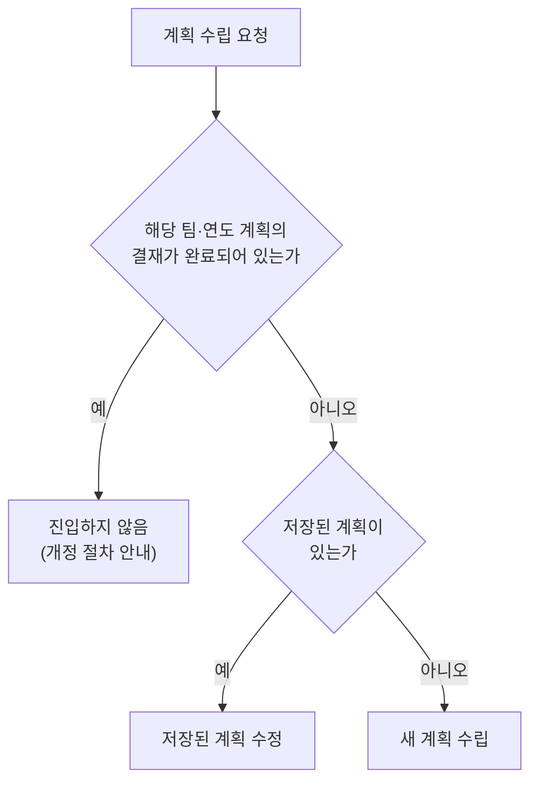

# 질문 에이전트

질문 에이전트는 계획 수립에 필요한 정보를 확보하는 에이전트입니다. 팀과 연도로 시작
방식을 판정하고, 팀에 매핑된 교육 목록을 확정받고, 설문으로 결정을 수집합니다. 답이 다
차기 전에는 다음 단계로 넘어가지 않으며, 답하지 않은 항목은 카드에 표시된 기본값으로
진행됩니다. 확정된 목록과 답은 [구상 에이전트](./plan-table-agent.md)가 계획표를 조립하는
기준이 됩니다.

## 진입 판정

계획 수립 요청을 받으면 팀과 연도를 기준으로 시작 방식을 판정합니다. 판정 결과는 새 계획
수립, 저장된 계획 수정, 일괄 생성의 세 경로 중 하나이며, 결재가 완료된 계획이 있는 팀은
어느 경로로도 진입하지 않고 개정 절차를 안내합니다.

요청에는 팀 식별자가 있어야 합니다. 없으면 화면에서 부서를 선택하도록 안내하고
진행하지 않습니다. 연도가 없으면 올해를 기준으로 합니다.



일괄 생성 호출은 같은 판정을 거치되, 저장된 계획이 있으면 수정으로 진입하는 대신 생성
대상이 아니라는 응답을 반환합니다. 이미 만들어 둔 계획을 덮어쓰지 않기 위한
동작입니다. 저장된 계획의 확인 자체가 실패하면 어느 경로로도 진행하지 않고 다시 시도를
안내합니다. 확인 없이 새로 시작하면 저장된 계획을 모르는 채 작업하게 되기 때문입니다.

### 새 계획 수립

저장된 계획이 없는 팀의 요청은 워크플로 1단계부터 시작합니다. 시스템이 팀에 매핑된
교육과정과 부서 정보(부서명·담당자)를 조회한 뒤, 계획 범위 질문을 제시합니다. 조회된
부서 담당자 이름은 이후 강사 질문의 기본값으로 쓰입니다.

### 저장된 계획 수정

결재 전 상태로 저장된 계획이 있는 팀의 요청은 그 계획을 불러와 바로 수정 단계로
진입합니다. 저장된 행의 값(회차, 시행월, 시간, 강사, 교육방법, 평가방법, 상세 내용)이
모두 복원되어 계획표로 제시되고, 담당자는 무엇이든 바로 수정할 수 있습니다.

설문 답은 저장 대상이 아니므로 복원되지 않습니다. 대신 새 설문 틀이 미답 상태로 함께
준비되어, 실시월 배정 방식이나 시간이 비어 있는 교육의 처리 같은 결정을 수정 중에 새로
내릴 수 있습니다. 저장된 계획이 법정 기준에 미달하는 상태라면 불러온 계획표에도 같은
경고가 표시됩니다.

저장된 계획을 버리고 처음부터 새로 만들려면 그 의사를 명시해야 합니다. "처음부터 다시
만들어줘" 같은 요청일 때만 새 계획 수립으로 진입하고, 단순한 수립 요청("계획 세워줘")은
저장된 계획이 있으면 항상 불러오기로 이어집니다.

| 담당자 입력 | 시스템 동작 |
|---|---|
| "올해 우리 팀 교육계획 수정하고 싶어요" | 저장된 계획을 불러와 계획표로 제시 |
| "정기교육 강사를 김서연으로 바꿔줘" | 값을 반영하고 바뀐 값을 보고 |
| "처음부터 다시 만들어줘" | 불러온 계획을 버리고 계획 범위 질문부터 새로 시작 |

### 일괄 생성

일괄 생성은 백엔드가 부서 목록을 돌며 대화 없이 호출하는 방식입니다. 설문을 운영
답안 한 벌로 채우고, 목록·요약·계획표의 확인 단계 없이 생성과 요건 검사까지 한 번의
호출로 진행합니다. 운영 답안은 필수 질문 여덟 가지의 답(계획 범위·시간 분할·교육방법·
평가방법·실시월 공란·강사)으로 코드에 정의되어 있으며, 강사는 부서 정보의 담당자로 지정됩니다.

교육시간과 회차는 답안이 아니라 데이터가 정합니다. 시간은 법정 교육시간을 따르고, 없으면
법령 원문에서 추출합니다. 대화형 진입과 같은 결측 처리입니다. 회차는 법정 주기를
따르되, 모든 과정을 연 2회로 나누는 운영 방침이 [편집 에이전트](./editor-agent.md)의
반영 경로로 얹힙니다. 방침 반영에 실패해도 일괄 생성은 멈추지 않으며, 시간이 끝내
확인되지 않는 과정은 미정으로 남아 계획에 경고로 표시됩니다.

저장된 계획이 있는 부서는 건너뛰고 그 사실을 응답하므로, 같은 부서에 반복 호출해도
계획이 중복 생성되거나 덮어써지지 않습니다.

### 결재가 완료된 계획

해당 팀·연도 계획의 결재가 완료된 상태이면 수정과 재작성 모두 진입하지 않습니다.
확정·결재된 계획의 변경은 이 탭이 아니라 운영 시스템의 개정 절차가 담당하며, 응답에서
그 경로를 안내합니다.


## 교육 목록 확정

교육 목록 확정은 올해 계획에 넣을 교육을 정하는 첫 단계입니다. 목록의 원천은 백엔드에
등록된 팀별 교육 매핑이며, 팀에 매핑된 교육만 목록에 오릅니다. 담당자는 목록에서
교육을 빼거나 되돌리거나 새로 추가할 수 있고, 확정된 목록이 이후 설문과 계획표의 대상
범위가 됩니다.

### 목록의 구성

목록의 교육은 세 갈래로 나뉩니다.

| 구분 | 성격 | 계획 편성 |
|---|---|---|
| 법정: 주기제 | 법으로 주기·시간이 정해져 반드시 실시하는 교육 | 기본 포함. 빼면 경고와 함께 진행 |
| 법정: 수시 | 채용·작업 변경처럼 해당 상황이 생길 때 실시하는 교육 | 기본 미편성. 올해 실시 예정을 밝히면 편성 |
| 자율 | 팀이 선택하는 비법정 교육 | 계획 범위 답에 따라 포함 |

### 제시 순서

법정 목록과 자율 목록이 차례로 제시되고, 마지막에 두 목록을 합친 전체 목록을 확인받은
뒤 설문으로 넘어갑니다. 계획 범위 질문에서 법정만 포함하기로 답한 경우 자율 교육은 모두
제외되고 자율 목록 단계는 건너뜁니다.

법정 목록 화면은 주기제 교육을 위에, 수시 교육을 아래에 배치합니다. 예시 팀의 화면은
다음 골격으로 제시됩니다.

| 과정 | 분류 | 법정 주기 | 법정 시간 |
|---|---|---|---|
| 정기 안전보건교육 | 법정 교육 | 반기 | 12h |
| 관리감독자 교육 | 법정 교육 | 연간 | 16h |
| 특별 안전작업 교육 | 법정 교육 | 정기 | 16h |
| 채용 시 교육 | 법정 교육 | 수시(발생 시) | 8h |

자율 목록에는 교육자료 생성 탭 문서의 예시 교육들이 오릅니다. 화학물질 취급 안전,
지게차 작업 안전, 밀폐공간 작업 안전.

### 수시 교육의 편성

수시 교육은 언급하지 않으면 계획에 편성되지 않고, 해당 상황이 생길 때 별도로 실시하는
것으로 남습니다. 올해 실시 예정을 밝히면 편성됩니다. "채용 시 교육은 3월에"처럼 월과
함께 말하면 그 월로, 월 없이 편성 의사만 밝히면 편성하되 실시 월을 되묻습니다.

### 목록 조정

어느 목록 화면에서든 교육을 빼거나 되돌리거나 추가할 수 있습니다.

- **빼기와 되돌리기**: 뺀 교육은 목록에서 삭제되지 않고 제외 상태로 남아, 이후 어느
  단계에서든 되돌릴 수 있습니다.
- **추가**: 등록된 교육과정에 같은 이름이 있으면 그 과정의 정보(법정 여부·주기·시간)로
  추가되고, 없으면 이름만으로 행을 만들며 등록 근거가 없어 시간과 주제를 직접 확인해야
  한다는 표시가 붙습니다.

### 요청 범위의 해석

"다 빼줘", "나머지도", "다 다시 넣어줘" 같은 총칭의 범위는 **지금 화면에 보이는
목록**입니다. 자율 목록 화면에서 "다 빼줘"라고 하면 자율 교육만 제외되고 법정 교육은
그대로입니다. 화면 밖까지 바꾸려면 "법정도 다"처럼 명시해야 합니다.

특정 교육을 지정하며 총칭을 쓰는 경우("지게차만 남기고 다 빼줘")에는 지정이 우선합니다.
지정된 교육은 남고 나머지만 제외됩니다.

### 법정 교육 제외와 경고

법정 주기제 교육을 빼는 요청은 차단하지 않고 반영하되 경고를 함께 표시합니다. 법정
요건을 충족하지 못할 수 있고, 제외된 교육은 요건 검사 대상에서도 빠진다는 내용입니다.
이 경고는 한 번 알리고 끝나는 알림이 아니라 **제외 상태가 유지되는 동안 목록·계획표·검사
결과 어느 화면에서든 표시되며**, 교육을 되돌리면 함께 사라집니다.

| 담당자 입력 | 시스템 동작 |
|---|---|
| "채용 예정이 있어서 채용 시 교육은 3월에 넣어주세요" | 수시 교육을 3월로 편성하고 목록에 반영 |
| "특별 안전작업 교육은 빼주세요" | 제외를 반영하고 법정 제외 경고를 표시 |
| (자율 목록 화면에서) "다 빼주세요" | 자율 교육만 제외: 법정 목록은 그대로 |
| "아까 뺀 특별 안전작업 교육 다시 넣어주세요" | 제외를 되돌리고 경고를 해제 |

### 전체 목록 확인

법정·수시 편성·자율의 최종 목록이 건수와 함께 합본 표로 제시됩니다. 담당자가 이 목록을
확인하면 설문 단계로 넘어가고, 조정 요청이 있으면 반영 후 다시 확인받습니다.

## 설문과 질문 카드

설문은 계획 조립에 필요한 결정을 수집하는 단계입니다. 필수 질문 여덟 가지가 질문
카드로 제시되고, 담당자는 보기를 선택하거나 자유 발화로 답합니다. **답하지 않은 항목은
카드에 표시된 기본값으로 진행**되므로, 세부 결정 전체를 위임하고 확인만 하며 진행할
수도 있습니다. 확정된 답은 연간 계획표 조립의 기준이 됩니다.

### 질문 목록

계획 범위는 시작 시점에 묻고, 나머지는 교육 목록 확정 후 시간·일정·실행의 세 묶음으로
차례로 제시됩니다.

| 질문 | 정하는 것 |
|---|---|
| 계획 범위 | 법정 교육만 넣을지, 자율 교육까지 넣을지 |
| 근로자 분류 | 정기교육의 법정 시간 기준: 사무직 여부에 따라 기준 시간이 갈림 |
| 무재해 감면 | 정기교육 시간의 감면 적용 여부 |
| 시간 분할 | 정기교육을 연간 몇 회로 나눠 실시할지 |
| 실시월 배정 방식 | 시행월이 빈 회차를 채우는 규칙: 반기 집중, 연중 분산, 과거 실시월 따르기, 배정하지 않음 |
| 교육방법 | 전 과정에 적용할 기본 교육방법: 보기는 백엔드 표준 코드 목록에서 만들어짐 |
| 평가방법 | 전 과정에 적용할 기본 평가방법: 교육 성격에 따른 자동 매핑 포함 |
| 강사 | 기본 강사: 부서 담당자, 미정, 직접 지정 |

근로자 분류와 무재해 감면은 계획 시간만이 아니라 **검사 기준이 되는 법정 시간 자체**를
조정합니다. 법이 허용하는 기준 조정이기 때문입니다. 반면 이후 대화로 시간을 바꾸는
것은 계획 시간만 바꾸며, 검사 기준은 그대로 남아 미달 여부를 알립니다.

### 카드의 실제 형태

응답 본문에 실리는 질문 묶음의 모양입니다(가공 예시). 미답 질문의 기본값 보기에는 ★가,
답한 질문의 선택 보기에는 ✓가 붙습니다. 질문 카드 블록(`:::q`)의 화면 렌더 계약은
[API 계약](../reference/api.md)에서 다룹니다.

```markdown
**[시간 설정]** (0/3 답변됨, 답하지 않은 항목은 ★기본값으로 진행합니다)

:::q
Q3. 시간 분할 — 한 번에 vs 나눠서(정기교육)
1) 연 1회 일괄
★2) 반기 2회
3) 분기 4회
4) 과정별 지정
왜: 나눠서 할지는 팀 사정입니다(법령 무관). 반기 주기 교육은 상·하반기 각 1회가
법정 최소입니다 — 그보다 적게 잡으면 경고와 함께 진행됩니다.
:::

보기를 선택하시거나 자유롭게 말씀해 주세요.
```

### 답변과 진행

- **보기 선택**: 화면의 보기 버튼을 누르면 그 답이 즉시 기록됩니다. 값이 함께 필요한
  보기("직접 지정", "과정별 지정")를 값 없이 선택하면 답을 확정하지 않고 어떤 값으로
  할지 되묻습니다.
- **자유 발화**: 한 발화로 여러 질문에 답하거나 보기 밖의 요구를 덧붙일 수 있습니다.
  지금 화면이 아닌 다른 단계 질문의 답을 미리 말해도 그 자리에 기록되어 사라지지
  않습니다.
- **과거 실적 힌트**: 평가방법과 강사 질문에는 팀의 과거 실시 기록에서 뽑은 힌트(가장
  많이 쓴 평가방법, 최근 강사)가 함께 표시되어 과거 기준으로 채울 수 있습니다.
- **묶음 넘어가기**: 진행 요청 시 그 묶음의 미답 항목이 기본값으로 채워지고, 어떤
  항목이 채워졌는지 안내됩니다.

### 시간이 확인되지 않는 교육의 처리

법정 교육인데 교육 데이터에 시간이 없는 경우, 시스템이 법령 정보 원문에서 연간 시간을
추출해 채웁니다. 그래도 확인되지 않는 교육이 있으면 처리 방법을 묻는 질문이 추가됩니다.
보기는 과거 실시 기록의 시간으로 채우기, 공란으로 두기, 직접 입력의 세 가지입니다. 공란으로
두기로 한 결정은 이후 단계에서도 존중되어, 법정 기준이 없는 교육의 빈 시간을 다시 묻지
않습니다. 법정 기준이 있는 교육의 시간이 비면 요건 검사가 충족 여부를 확인할 수 없다는
경고를 표시합니다.

### 확정 요약

세 묶음이 끝나면 질문과 답 전체가 표로 제시됩니다. 기본값으로 채워진 항목에는 그 표시가,
과거 실적 기준으로 채운 항목에는 그 출처가 붙고, 계획에 들어갈 교육 수가 법정·수시
편성·자율로 나뉘어 집계됩니다. 담당자가 이 요약을 확인하면 연간 계획표 조립이
시작됩니다.

이 에이전트가 맡는 기능을 고치려면 [유지보수의 질문 에이전트](../maintenance/annual-plan/question-agent.md)을 보십시오.

## 코드 참조

| 구성 요소 | 코드 이름 | 모듈 경로 |
|---|---|---|
| 진입 판정·목록·설문 진행·카드 렌더 | `IntakeAgent` | `src/tabs/annual_plan/intake/agent.py` |
| 저장된 계획 복원 | `restore_saved_plan` | `src/tabs/annual_plan/plan_table/restore.py` |
| 일괄 생성 기본값 | `build_auto_sheet` | `src/tabs/annual_plan/intake/auto.py` |
| 재시작 신호 | `AnnualRouterAgent` | `src/tabs/annual_plan/router/agent.py` |
| 목록 항목 | `EduListEntry` | `src/schemas/questions.py` |
| 질문·보기 모델과 설문 상태 | `SheetQuestion` / `QuestionOption` / `QuestionSheet` | `src/schemas/questions.py` |
| 법령 시간 추출 | `HoursExtraction` | `src/schemas/questions.py` |
| 법정 제외 경고 | `statutory_exclusion_warning` | `src/tabs/annual_plan/plan_table/agent.py` |
| 화면 범위 판단 재료 | `PlanEditorAgent` | `src/tabs/annual_plan/editor/agent.py` |
