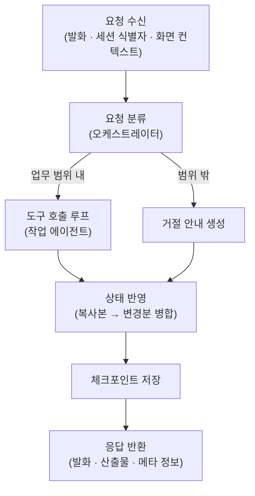

# 요청 처리 흐름

대화형 탭의 모든 상호작용은 **턴** 단위로 처리됩니다. 하나의 턴은 **요청 수신부터 응답
반환까지**를 말하며, 요청 분류·상태 반영·체크포인트 저장의 공통 단계를 거칩니다. 작업
처리 방식은 탭마다 다릅니다 — 이 페이지는 공통 구조와 함께 교육자료 생성 탭의 도구 호출
구조를 설명하며, 연간 교육계획 탭의 처리 구조는 해당 장에서 다룹니다(작성 예정).

## 요청과 응답

요청에는 이번 발화, 세션 식별자, 그리고 화면이 매 턴 제공하는 컨텍스트(팀 정보, 첨부
파일 목록, 작성 현황 등)가 포함됩니다. 응답은 성공·실패와 관계없이 동일한 구조의
**봉투**(envelope)로 반환되며, 성공 여부·대화 메시지·산출물·메타 정보(질문 카드, 추천
문구)를 포함합니다. 필드 수준 계약은 [API 계약](../reference/api.md)에서 다룹니다.

## 요청 분류

턴의 첫 단계는 **오케스트레이터**의 요청 분류입니다. 처리 경로는 세 가지입니다.

| 조건 | 처리 |
|---|---|
| 발화 없는 최초 진입 | 팀 정보가 있으면 교육 후보 안내로 진행, 없으면 고정 환영 문구로 응답 (LLM 미사용) |
| 업무 범위 내 발화 | LLM이 전체 대화 이력을 참조해 판정 후 작업 에이전트로 라우팅 |
| 업무 범위 밖 발화 | 거절 안내 생성 |

거절 안내를 생성하는 LLM 호출에는 **도구가 연결되지 않습니다**. 사용자 입력에 도구 실행을
유도하는 지시가 포함되어 있어도 실행 경로가 존재하지 않습니다.

## 도구 호출 루프

교육자료 생성 탭에서는 분류를 통과한 발화를 작업 에이전트가 단독으로 처리합니다. 생성·시험·수정·확정 등의
작업은 별도의 그래프 노드가 아니라 **대화 LLM이 호출하는 도구**로 구현되어 있습니다. 도구는
호출 즉시 실행되고, 실행 결과가 사실 텍스트로 LLM에 반환되며, LLM이 결과를 종합해 최종
응답 발화를 작성합니다.

이 구조는 **응답 생성 지점을 하나로 유지**하기 위한 설계입니다. 작업별 노드가 각자 발화
조각을 생성하면 하나의 턴에 서로 다른 맥락의 문장이 섞입니다. 단일 지점에서 생성하면
복수 요청이 결합된 발화("2교시 수정하고 시험 문항도 하나 빼줘")도 일관된 응답으로
처리됩니다.

도구는 세션 상태에 따라 두 구성으로 제공됩니다.

| 모드 | 조건 | 도구 구성 |
|---|---|---|
| 선택 모드 | 교육 미선택 | 후보 목록 제시, 교육 시작(연간 교육계획·즉석 주제·첨부 기반), 보관 작업 복귀, 데이터 조회 |
| 작업 모드 | 교육 선택 후 | 설정 카드, 구성 계획 수정, 근거 관리, 생성, 시험, 부분 수정, 확정, 교육 전환 등 25종과 데이터 조회 |

루프에는 다음 보호 장치가 적용됩니다.

- 도구 호출 횟수 상한 — 무한 반복 방지
- 동일 도구·동일 인자 재호출 차단 — 실패·거부 반환은 재시도 허용
- 턴당 주요 전환(교육 시작·교육 전환) 1회 제한 — 먼저 실행된 전환이 유효하며, 이후
  시도는 거부 사실이 LLM에 전달됨

## 컨텍스트 구성

대화 LLM의 입력은 세 부분으로 구성됩니다.

1. **행동 지침** — 시스템 프롬프트
2. **전체 대화 이력**
3. **상태 요약** — 작업 중인 교육, 구성 계획 전문, 근거 수량, 기존 산출물 등 코드가
   산출한 현재 상태 사실

상태 요약을 코드가 공급하므로 LLM이 세션 상태를 추정하지 않습니다. 설계 배경은
[설계 원칙](../maintenance/design-principles.md)에서 다룹니다.

## 상태 반영

턴 시작 시점의 세션 상태는 변경되지 않습니다. 도구는 **깊은 복사본** 위에서 동작하며, 같은
턴의 후속 도구는 선행 도구가 변경한 최신 값을 참조합니다. 턴 종료 시 **변경분만 델타로**
상태에 병합됩니다. 이 구조로 인해 턴이 중단되어도 원본 상태는 영향을 받지 않습니다.

이때 "복사본의 최신 값을 노출하는 규칙"과 "변경분을 병합하는 규칙"은 동일하게 유지되어야
합니다. 두 규칙이 어긋나면 응답으로 보고된 내용과 저장된 상태가 달라집니다. 유지보수
장의 [불변식](../maintenance/invariants.md)에서 다룹니다.

## 세션 관리

### 체크포인트

턴 종료 시 세션 상태 전체가 체크포인트 저장소(내장 DB)에 기록됩니다. 동일한 세션
식별자의 후속 요청은 상태 전체를 복원한 뒤 처리되며, 서비스 재시작 후에도 세션이
유지됩니다.

복원 범위는 구조화된 상태(구성 계획, 근거, 산출물, 질문 카드)와 대화 메시지
텍스트입니다. 턴 내부의 도구 호출 기록은 **저장되지 않으므로**, 이전 턴의 조회 결과가
필요한 경우 다시 조회합니다.

### 작업공간 전환

하나의 세션에서 복수의 교육을 작업할 수 있습니다. 다른 교육으로 전환하면 현재 작업
상태(계획·근거·산출물)가 **작업공간**으로 보관되고, 복귀 시 전체가 복원됩니다.

### 동시 요청 처리

동일 세션에 요청이 겹치면 진행 중인 턴을 취소하고, 해당 턴이 남긴 체크포인트 기록을
되돌린 뒤 새 턴을 시작합니다. **세션당 실행 중인 턴은 항상 하나**입니다.

## 코드 참조

| 구성 요소 | 코드 이름 | 모듈 경로 |
|---|---|---|
| 탭 그래프와 오케스트레이터 | `ContentTabOrchestrator` | `src/tabs/edu_material/graph.py` |
| 작업 에이전트 | `ContentIntakeAgent` | `src/tabs/edu_material/handle_request/agent.py` |
| 도구 호출 루프 | `run_tool_loop` | `src/agents/base.py` |
| 상태 요약 생성 | `_work_note` / `_select_note` | `src/tabs/edu_material/handle_request/agent.py` |
| 상태 복사본·델타 | `_live_state` / `_work_delta` | `src/tabs/edu_material/handle_request/agent.py` |
| 응답 변환 | — | `src/api/converters.py` |
| 체크포인트 저장 | — | `src/api/main.py` |
| 턴 동시성 제어 | `begin_exclusive_turn` | `src/api/turns.py` |
| 작업공간 보관·복원 | — | `src/tabs/edu_material/handle_request/workspace.py` |
