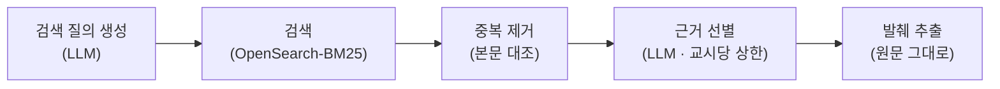

# 문서 수집

교육자료 내용의 출처가 되는 문서들 — 연간 교육계획의 교육내용, 법령 문서, 첨부 문서, 사내
문서 — 을 **교시 단위로 수집**하는 단계입니다. 수집된 문서들은 화면에 **참고 근거**로
표시되며 — 법령 같은 법적 근거도 그 한 종류입니다 — 이 문서에서도 이를 근거라
부릅니다. 생성 단계는 **수집된 근거만으로** 내용을 구성합니다. 관련 사내 문서를 찾지 못하면 그 사실을 담당자에게 안내하고 연간 교육계획·법령
근거만으로 진행합니다. 연간 교육계획의 교육내용 서술이 비어 있고 사내 문서 검색으로도
보강되지 않았거나, 즉석 주제인데 검색 결과가 없는 경우처럼 **어느 경로에서도 재료를
확보하지 못하면 생성하지 않고 그 사실을 안내합니다**.

## 수집하는 문서의 종류

| 종류 | 출처 | 수집 방식 |
|---|---|---|
| 연간계획 교육내용 | 구성 계획의 교시별 주제 | 교시마다 자동 편입 |
| 법령 문서 | 연간 교육계획 조회 시 함께 받는 교육과정의 법령 정보 | 법정 교육인 경우 자동 편입 (전 교시에 적용) |
| 첨부 문서 | 담당자 업로드 파일 | 교시 귀속 판정 후 편입 ([첨부 자료 처리](./uploads.md)) |
| 사내 문서 | 사내 문서 검색 엔진 | 아래 검색·선별 절차로 수집 |

## 사내 문서 수집 절차

교시마다 다음 절차를 수행합니다.

1. **검색 질의 생성** — 교시의 주제와 담당자 요구사항으로 검색 질의를 생성합니다. 생성에
   실패하면 교육명·주제 기반의 고정 질의로 대체합니다.
2. **검색** — 사내 문서 검색 엔진 OpenSearch에서 BM25 키워드 검색으로 후보 문서를
   수집합니다(색인 구조와 접속 정보는 [외부 의존](../reference/external-services.md) 참조).
3. **중복 제거** — 후보의 원문을 확보해 본문이 동일한 문서를 제거합니다.
4. **근거 선별** — LLM이 후보의 요약·본문을 검토해 교시당 상한 내에서 채택할 문서와
   종류(법령, 안전보건 가이드, 내부 규정, 사고사례, 과거 자료)를 결정합니다. 실패 시 검색
   점수 상위 문서로 대체합니다.
5. **발췌 추출** — 채택 문서에서 주제 키워드가 포함된 문단을 **원문 그대로** 추출합니다.
   발췌는 LLM 요약이 아닙니다([설계 원칙](../maintenance/design-principles.md)의 원문 발췌 참조).

검색 엔진에 연결할 수 없는 경우 수집은 **계획·법령·첨부만으로 진행**되고, 검색이 불가한
상태라는 사실이 담당자 안내에 포함됩니다.

## 문서 수집 범위

문서 수집 범위는 사내 문서 검색을 수행할지 결정하는 설정입니다. 담당자가 대화로
지정합니다 — "첨부한 문서만으로 만들어 줘", "사내 자료도 찾아서 보강해 줘".

| 값 | 동작 |
|---|---|
| 첨부 문서만 | 사내 문서 검색을 수행하지 않음 |
| 사내 문서 보강 | 위 수집 절차 전체 수행 |

미지정 시 첨부가 있으면 첨부 문서만, 없으면 사내 문서 보강으로 동작합니다. 수집이
끝난 뒤에도 대화로 범위를 바꿀 수 있으며, 바뀌면 아래 재수집 게이트가 문서를 다시
수집하게 합니다.

## 재수집 게이트

수집된 근거에는 수집 당시의 재료(첨부 목록, 제외 지정, 생성 단위·구성 방식·문서 수집 범위
설정) 값을 그대로 담은 대조용 기록이 **지문**으로 남습니다. 생성 시점에 현재 재료로 지문을 다시 계산해 비교하고, 다르면
**생성을 차단하고 재수집을 안내**합니다. 지문은 저장된 판정이 아니라 매번 다시 계산하는
비교입니다.

## 구성 계획 수정 후 문서 재구성

구성 계획이 수정되면 문서를 **전량 재수집하지 않습니다**. 연간 교육계획 교육내용과 법령
문서 항목은 원천이 수정된 구성 계획과 이미 보관된 법령 정보이므로, 검색 없이 새 교시
구성 기준으로 다시 조립합니다. 사내 문서·첨부 문서 항목은 수정 전후 교시의 대응 관계([구성 계획](./syllabus.md)의 출처 교시 기록)를 따라
승계하며, 새로 생긴 교시만 검색을 수행합니다. 대응이
끊긴 근거는 폐기합니다. 증분 재구성에 실패하면 전량 재수집으로 대체합니다.

## 대화 중 문서 원문 조회

담당자가 근거의 자세한 내용을 물으면, LLM이 근거 조회 도구로 해당 근거의 **원문 전문**을
확보해 답합니다. 조회 결과는 대화 응답에 실을 수 있는 분량 한도 내에서 제공되며, 한도를
넘는 경우 주제 관련 문단 위주로 줄여 제공합니다.

## 코드 참조

| 구성 요소 | 코드 이름 | 모듈 경로 |
|---|---|---|
| 문서 수집 파이프라인 | `ContentEvidenceAgent` | `src/tabs/edu_material/pipelines/collect_evidence/agent.py` |
| 문서 전문 공급·분량 한도 조정 | `evidence_full_text` / `fit_to_budget` | `src/tabs/edu_material/pipelines/collect_evidence/supply.py` |
| 문서 재수집 게이트 | `basis_of` / `is_stale` | `src/tabs/edu_material/handle_request/evidence_basis.py` |
| 수정 후 문서 재구성 | `rebuild_after_revision` | `src/tabs/edu_material/pipelines/collect_evidence/agent.py` |
| 사내 문서 검색·원문 조회 | `DocumentsSearch` | `src/skills/documents/queries.py` |
| 대화 중 문서 원문 조회 도구 | `build_evidence_lookup_tool` | `src/tabs/edu_material/pipelines/collect_evidence/supply.py` |
