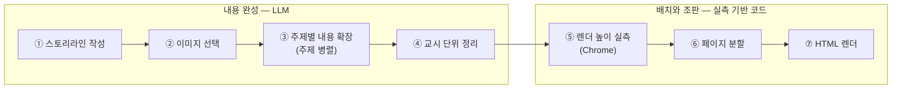

# 교육자료 생성

교육자료 생성은 수집된 근거로 교시별 내용을 완성한 뒤, 실측 기반으로 페이지를 구성해
HTML 문서를 만드는 파이프라인입니다. **내용을 먼저 완성하고 배치를 마지막에 결정하는**
순서를 따릅니다 — 페이지를 먼저 나누면 내용이 틀에 맞춰 잘리거나 늘어나기 때문입니다.

## 파이프라인

교시들은 **병렬로 처리**되며, 각 교시는 두 국면을 순서대로 지납니다. 앞 국면에서는
LLM이 근거를 읽고 내용을 완성하고, 뒤 국면에서는 코드가 완성된 내용을 실측해 페이지에
배치합니다.



### 내용 완성 — LLM

**① 스토리라인 작성** — 입력은 교시의 계획 서술과 채택 문서의 전문(**발췌가 아니라
전문**이 공급 분량 한도 내에서 제공됩니다), 이미지 후보 목록, 대화에서 접수된 요구
사항입니다. LLM은 이 교시를 몇 개의 주제로 나눠 어떤 순서로 전개할지 설계합니다.
결과는 학습목표와 **주제 시퀀스**입니다 — 주제마다 제목, 전개상 역할(도입·전개·심화·
정리), 핵심 메시지, 시간 배분, 사용할 근거 문서와 이미지가 배정됩니다. 교시를 닫는
사례·문답·요점 정리도 별도 절차가 아니라 이 시퀀스의 **정리 역할 주제**로 함께
설계되므로, 대화로 접수된 요구가 본문과 마무리에 똑같이 반영됩니다. 페이지를 몇 장으로
나눌지는 여기서 정하지 않습니다. 주제 시퀀스는 다음과 같은 모양입니다(가공 예시).

```text
학습목표: 밀폐공간 작업의 위험을 이해하고 작업 전 확인 절차를 적용할 수 있다
1. [도입] 밀폐공간과 질식 위험 — 왜 보이지 않는 위험인지 (15분)
2. [전개] 작업 전 확인 절차 — 가스농도 측정과 작업허가 (20분)
3. [심화] 사고 사례와 원인 분석 — 환기 없이 진입한 사례 (10분)
4. [정리] 문답 점검과 요점 정리 (5분)
```

**② 이미지 선택** — 스토리라인이 주제에 배정한 이미지 후보를 LLM이 **실물로 열어 보고**
주제와 맞는지 판정합니다. 판정은 세 가지입니다 — 그대로 쓰거나, 더 맞는 주제로 옮기거나,
제외합니다. 담당자가 교시당 사진 상한을 지정한 경우 상한만큼만 남깁니다.

**③ 주제별 내용 확장** — 주제마다 병렬로, 자기 주제에 배정된 문서의 전문을 입력으로
**유닛**을 작성합니다.

- 유닛은 화면 구성의 최소 단위입니다. 요점 목록, 절차(단계와 세부 설명), 표, 점검표,
  용어 설명, 사례, 문답, 이미지 등의 타입이 있습니다.
- 유닛은 타입마다 전용 구조를 가지며, **타입이 곧 화면 컴포넌트를 결정**합니다 — 절차
  유닛은 번호 리스트 카드로, 표 유닛은 표로 그려집니다. 내용의 성격이 형태를 결정하므로,
  표에 담길 내용이 문단에 눌려 들어가는 식의 불일치가 생성 시점에 차단됩니다.
- 예를 들어 "작업 전 확인 절차" 주제라면 절차 유닛(측정 → 허가 → 감시인 배치)과 표
  유닛(가스별 허용 농도 기준)이 작성되는 식입니다.

**④ 교시 단위 정리** — 주제들이 병렬로 작성되기 때문에, 주제 사이에 표현만 다른 중복이나
주제 경계를 넘은 내용이 남을 수 있습니다. 교시 전체 유닛을 한 번에 놓고 중복을 정리하고
흐름을 연결하며, 아래 분량 처리 절의 분량 예산을 반영합니다. 이 호출이 실패하면 원본
유닛을 그대로 사용합니다.

### 배치와 조판 — 실측 기반 코드

**⑤ 렌더 높이 실측** — 유닛 하나하나를 실제 산출물과 같은 HTML 조각으로 렌더하고
Chrome으로 픽셀 높이를 측정합니다. 추정치가 아니라 실제로 그려 본 값이라, 내용이 긴
표나 큰 그림도 정확한 높이로 배치할 수 있습니다.

**⑥ 페이지 분할** — 실측 높이를 기준으로, 한 페이지가 담는 높이 한도(**페이지 예산**)
안에 유닛을 차례로 채웁니다. 주제가 바뀌면 페이지를 나누고, 한 페이지를 넘는 유닛은
항목 경계에서 분할하며, 그림이 캡션과 떨어져 홀로 남지 않게 조정합니다. 문서 형태에
따라 분할의 결정 주체가 다릅니다 — 아래 문서 형태 절에서 다룹니다.

**⑦ HTML 렌더** — 배치된 페이지들을 표지와 함께 **자기완결 HTML 문서**로 조립합니다.
출처 목록은 채택된 근거 기록에서 코드가 조립해 본문 마지막에 이어 붙입니다. 외부 리소스
참조가 없어 단독 파일로 열립니다.

## 문서 형태

| 형태 | 캔버스 | 특징 |
|---|---|---|
| 세로형 문서 | 문서형 페이지 | 한 단 구성. 페이지 분할을 실측 배치가 전담 |
| 가로형 발표 자료 | 슬라이드형 페이지 | 표지·간지·목차 구성. 슬라이드 구성 LLM이 페이지 묶음을 계획하고 실측이 검증 |

세로형이 슬라이드 구성 LLM을 사용하지 않는 것은 실측 결과에 근거한 결정입니다 —
세로형 유닛은 페이지 대비 크기가 작아 한 페이지에 여러 개가 들어가는데, 이 배치 산술은
LLM보다 실측 기반 코드가 정확합니다.

생성 단위 설정이 회차 통합이면 교시 문서들을 묶은 통합 문서(전체 목차 포함)가 함께
생성됩니다. 페이지마다 사용한 근거가 기록되어, 화면에서 페이지별 출처를 확인할 수
있습니다.

## 분량 처리

교시별 지정 쪽수에서 고정 구성(표지·마무리)을 제외한 본문 분량 예산을 산출하고, 주제 수로
나눈 몫을 각 주제의 작성 지시에 포함합니다. 생성 완료 후에는 실측 페이지 수와 지정
분량의 차이·방향(일치, 근접, 초과, 미달)을 **코드가 확정해 보고 발화에 공급**합니다([설계
원칙](../maintenance/design-principles.md)의 사실 기반 컨텍스트 구성 참조). 분량이 지정보다 많거나
적어도 코드가 내용을 **임의로 깎거나 부풀리지 않습니다**.

## 완료 보고의 형태

생성이 끝나면 두 가지가 만들어집니다(가공 예시). 하나는 담당자 화면에 붙는 보고
블록이고, 다른 하나는 발화 LLM에 공급되는 분량 실측 사실 문장입니다 — 후자가 있어
완료 발화가 실측과 다른 수치를 말하지 못합니다.

```markdown
**교육자료** (2교시 · 21페이지 · 교시별 HTML)

| 교시 | 페이지 | 구성 | 주요 출처 |
|---|---|---|---|
| 1교시 | 12p | 표지→내용8→사례→요점→출처 | 밀폐공간 질식재해 예방 가이드 · 작업허가 절차 안내 |
| 2교시 | 9p | 표지→내용6→요점→출처 | 밀폐공간 구조 훈련 자료 |
```

```text
분량 실측(총 21p): 1교시 12p(지정 12p 일치 · 주제 3개→본문 8p · 이미지 2장)
/ 2교시 9p(지정 10p 근접(-1p) · 주제 2개→본문 6p).
위 수치와 방향 표기는 실측이다 — 실측과 다른 방향이나 수치로 말하지 말 것.
```

## 요약본

요약본은 분량(쪽수 또는 비율)을 **지정한 경우에만 생성**됩니다. 쪽수 지정이 비율보다
우선합니다.

1. 완성된 교육자료의 전 교시 내용을 평문으로 직렬화해 입력으로 제공합니다.
2. LLM이 목표 분량 기준으로 압축본을 작성합니다. 이미지 유닛은 포함하지 않습니다.
3. 본문과 동일한 실측·페이지 분할·렌더 절차로 조판합니다.
4. 실측 페이지가 목표를 초과하면 압축 재작성을 1회 시도하고, 그래도 초과하면 결과를
   그대로 채택합니다 — **코드가 유닛을 삭감하지 않습니다**. 목표와 실제의 차이는 완료
   보고에 사실로 포함됩니다.

## 코드 참조

| 구성 요소 | 코드 이름 | 모듈 경로 |
|---|---|---|
| 생성 파이프라인 | `DeckComposer` | `src/tabs/edu_material/pipelines/generate_content/deck.py` |
| 유닛 → 화면 조각 매핑 | `unit_block` | `src/tabs/edu_material/pipelines/generate_content/components/compose.py` |
| 조각 카탈로그 | — | `src/tabs/edu_material/pipelines/generate_content/components/catalog.py` |
| 이미지 인벤토리·판독 | — | `src/tabs/edu_material/pipelines/generate_content/components/images.py` / `annotate.py` |
| 렌더 높이 실측 | `measure_heights` | `src/tabs/edu_material/pipelines/generate_content/components/measure.py` |
| 세로형 렌더러 | — | `src/tabs/edu_material/pipelines/generate_content/deck_render.py` |
| 가로형 렌더러 | — | `src/tabs/edu_material/pipelines/generate_content/deck_render_landscape.py` |
| 생성 실행·완료 보고 사실 | `produce_content` / `volume_facts` | `src/tabs/edu_material/handle_request/produce.py` |
