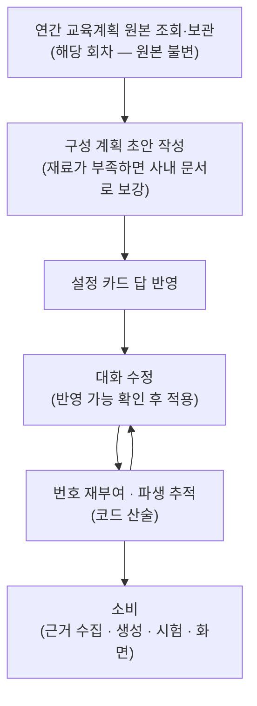

# 교육자료 구성 계획 수립

**구성 계획**은 "**이 교육에서 무엇을 가르칠 것인가**"를 정의하는 데이터 구조이며, 이 탭의 모든
파이프라인이 참조하는 **단일 소스**입니다. 근거 수집, 자료 생성, 시험 출제, 부분 수정, 화면
표시가 모두 이 구조 하나를 읽습니다.

구성 계획은 다음 요소로 구성됩니다.

| 구성 요소 | 내용 |
|---|---|
| 교육 정보 | 교육 제목, 회차, 교육시간 |
| 교시별 구성 | 교시 제목, 다룰 주제, 분량(쪽), 사진 상한 |
| 담당자 요구사항 | 회차 전체 또는 교시 단위로 남긴 자연어 요구 |
| 생성 설정 | 문서 형태, 생성 단위, 난이도, 구성 방식, 요약본, 근거 범위 |

이 중 교시별 구성과 담당자 요구사항이 "무엇을 가르칠 것인가"를 정하고, 함께 저장되는
[생성 설정](./settings.md)은 그 내용을 "어떤 형태와 방식으로 만들 것인가"를 정합니다.
교육 정보는 이 계획이 어느 교육의 어느 회차에 대한 것인지를 식별합니다.

## 수명주기

구성 계획은 교육이 선택되는 시점에 만들어지고, 담당자와의 대화로 다듬어진 뒤, 생성·시험
작업의 기준으로 읽힙니다.



**연간 교육계획 원본(해당 회차) 조회와 보관.** 교육이 선택되면 백엔드에서 그 교육의 연간
교육계획 원본(해당 회차의 교육내용)과 교육과정 정보, 법령 근거를 조회합니다. 조회된 연간
교육계획 내용·교육과정 정보·법령 근거가 구성 계획 작성의 **재료**가 됩니다. **구성
계획**은 이 연간 교육계획 내용을 기반으로 다음 단계에서 새로 만들어지는 **별도의
계획**이며, 연간 교육계획 원본 자체는 별도로 보관되어 **이후 어떤 수정에도 변하지
않습니다**. 담당자의 수정은 구성 계획에만 쌓이므로, 연간 교육계획 원본에서 무엇이
달라졌는지 언제든 대조할 수 있습니다. 연간 교육계획 없이 시작하는 경우에는 재료가
달라집니다 — 즉석 주제로 시작하면 지정한 주제와 사내 문서 검색 결과가, 첨부 문서
기반으로 시작하면 해당 문서의 내용이 재료가 됩니다(진입 경로별 상세는
[교육 선택과 진입](./course-entry.md) 참조).

**구성 계획 초안 작성.** LLM이 준비된 재료로 교시 구성 초안을 작성합니다. 재료만으로 부족하면
먼저 사내 문서를 검색해 보강한 뒤 작성합니다. 제목·회차·교육시간처럼 시스템이 이미 알고
있는 값은 LLM 출력을 쓰지 않고 조회된 값을 그대로 채웁니다.

**설정 카드 답 반영.** 질문 카드의 답변(문서 형태·난이도·분량 등)은 계획으로 옮겨져
계획의 일부가 됩니다. 이후 화면 표시·생성·완료 보고가 모두 계획에서 이 값을 읽습니다.

**대화 수정.** "2교시를 둘로 나눠 줘" 같은 요구가 오면, 현재 계획과 재료로 반영할 수
있는지 먼저 확인한 뒤 계획을 다시 씁니다. 대화 이력을 함께 참조하므로 "아까 말한
것"처럼 맥락에 기대는 지시도 처리됩니다. 반영에 실패하면 **계획은 그대로 두고** 실패
사실을 알립니다. 담당자가 수치로 직접 지정하는 값(교시 분량, 사진 상한, 근거 범위)은
해석 없이 계획의 해당 자리에 그대로 기록됩니다.

**번호 재부여와 파생 추적.** 수정으로 교시가 합쳐지거나 나뉘면 교시 번호는 배열 순서대로
다시 매겨집니다. 각 교시에는 수정 전 어느 교시에서 왔는지가 한 세대만 기록되어, 이미
수집된 근거를 새 교시 번호로 이어받는 데 사용된 뒤 제거됩니다. 이런 번호 계산은 LLM이
아니라 코드가 수행합니다.

**소비.** 확정된 구성 계획은 근거 수집(교시별 주제로 검색 질의를 구성), 생성(설정과 교시
구성·쪽수), 시험(교시 구성과 요구사항), 화면(담당자에게 제시되는 구성 계획 블록)이 각자
읽습니다. 자료 생성
이후의 부분 수정은 **계획을 변경하지 않습니다** — 산출물 위의 수정은 "**무엇을
가르칠지**"의 변경이 아니기 때문입니다.

## 일관성이 유지되는 방식

구성 계획이 여러 곳에서 읽히는데도 서로 어긋나지 않는 것은 두 가지 덕분입니다.

- **구성 계획을 고치는 경로가 하나로 모입니다.** 카드 답 반영, 대화 수정, 수치 직접
  지정 — 어느 경로로 바꾸든 같은 수정 코드를 거칩니다. 구성 계획을 읽는 기능(근거
  수집·생성·시험·화면)은 읽기만 하고 고치지 않으므로, 계획이 모르는 사이에 바뀌는 일이
  없습니다.
- **모두가 같은 구성 계획 하나를 읽습니다.** 담당자가 화면에서 보는 계획, 대화가
  참조하는 계획, 수정 요청을 해석할 때 기준이 되는 계획이 전부 같은 구성 계획
  객체입니다. 화면에 보이는 것과 실제로 반영되는 것이 어긋나지 않는 이유입니다.

## 화면에 표시되는 형태

담당자에게 제시되는 구성 계획 블록의 모양입니다(가공 예시). 참고 근거 목록이 함께
표시되며, 채택된 근거는 생성되는 모든 페이지에 출처로 연결됩니다.

```markdown
**밀폐공간 작업 안전 — 교육자료 구성 계획** (2교시)

**1교시 · 밀폐공간의 위험과 사전 확인** · 50분 · 지정 12페이지
- 밀폐공간의 정의와 대상 작업
- 산소농도·유해가스 측정
- 작업 전 허가 절차

**2교시 · 작업 중 안전수칙과 비상대응** · 50분
- 감시인 배치와 통신 유지
- 비상시 구조 절차

이 구성으로 진행해도 될까요? 추가로 반영할 내용이 있으면 말씀해 주세요.

---
**참고 근거** — 생성되는 모든 페이지에 [출처]로 연결됩니다
- 법령: 산업안전보건기준에 관한 규칙(밀폐공간 작업)
- 1교시: 밀폐공간 질식재해 예방 가이드 · 작업허가 절차 안내
- 2교시: 밀폐공간 구조 훈련 자료
```

## 데이터 구조

계획 본체, 교시, 생성 설정의 세 층으로 구성됩니다. 필드별 정의는 스키마 파일에 LLM이
읽는 필드 설명으로 작성되어 있으며, 정확한 계약은 스키마 파일이 기준입니다.

**계획 본체**

| 필드 | 정의 |
|---|---|
| `title` | 교육 제목. 복수 회차 중 하나인 경우 회차 표기가 붙음 |
| `edu_ref` | 출처 교육과정 식별 정보(과정번호·교육명) |
| `round_no` / `planned_hours` | 회차 번호, 계획된 교육시간 |
| `source` | 계획 서술의 출처 구분 — 연간 교육계획 원문 기반 / 옮겨 적음 / 신규 구성 |
| `syllabus_notes` / `extra_syllabus_notes` | 회차 전체에 적용되는 담당자 요구 / 연간 교육계획 원문의 기타 항목 |
| `settings` | 생성 설정 (아래 표) |
| `sessions` | 교시 목록 — 배열 순서가 교시 순서 |

**교시**

| 필드 | 정의 |
|---|---|
| `session_no` | 교시 번호 — 배열 순서 기준으로 코드가 재부여 |
| `session_title` / `topics` | 교시 제목, 다룰 주제 목록 |
| `pages` | 교시 분량(쪽) — 분량 값이 존재하는 유일한 위치 |
| `photos` | 사진 상한 — 0은 이미지 제외, 미지정은 제한 없음 |
| `minutes` | 표시용 시간 — 분량 판단에 사용하지 않음 |
| `session_notes` / `extra_session_notes` | 교시 단위 담당자 요구 / 원문의 기타 항목 |
| `from_sessions` | 수정 전 파생 원점 교시 — 근거 승계용, 한 세대만 유지 |

**생성 설정** — 전 필드가 미지정 상태를 허용하며, 미지정 시 소비 측이 기본값을 적용합니다.

| 필드 | 정의 |
|---|---|
| `template` | 문서 형태 — 세로형 문서 / 가로형 발표 자료 |
| `unit` | 생성 단위 — 회차 통합 문서 / 교시별 문서 |
| `level` | 난이도 — 동일 분량 내에서 다룰 내용의 수준 (분량 아님) |
| `style` | 구성 방식 — 강의식, 문답식, 사례 중심, 체크리스트 등 |
| `condensed_ratio` / `condensed_pages` | 요약본 분량 — 쪽수 지정이 비율보다 우선, 모두 미지정이면 요약본 미생성 |
| `evidence_scope` | 근거 범위 — 첨부 문서만 / 사내 문서 보강 |

시험 구성(문항 수·유형)은 구성 계획이 아니라 별도의 시험 구성 값에 저장됩니다.
[시험과 강의평가](./exam.md)에서 다룹니다.

## 코드 참조

| 구성 요소 | 코드 이름 | 모듈 경로 |
|---|---|---|
| 구성 계획 타입(세 층) | `Syllabus` / `SyllabusSession` / `GenerationSettings` | `src/schemas/syllabus.py` |
| 계획 패키지 | — | `src/tabs/edu_material/syllabus/` |
| 재료 조립 | `AnnualPlanLoader` | `src/tabs/edu_material/syllabus/load_annual_plan.py` |
| 계획 작성 | `SyllabusBuilder` | `src/tabs/edu_material/syllabus/build_syllabus.py` |
| 자유 수정 | `SyllabusReviser` | `src/tabs/edu_material/syllabus/apply_request.py` |
| 카드 답 반영 | `apply_card_answers` | `src/tabs/edu_material/syllabus/settings_sync.py` |
| 번호 재부여·파생 추적 | `renumber_sessions` 외 | `src/tabs/edu_material/syllabus/renumber.py` |
| LLM 입력용 계획 렌더 | `render_syllabus` | `src/tabs/edu_material/syllabus/apply_request.py` |
| 화면용 계획 블록 렌더 | `render_plan_block` | `src/tabs/edu_material/syllabus/render_block.py` |
| 연간 교육계획 원본(불변) | `annual_source_plan` | `src/schemas/education_content.py` |
