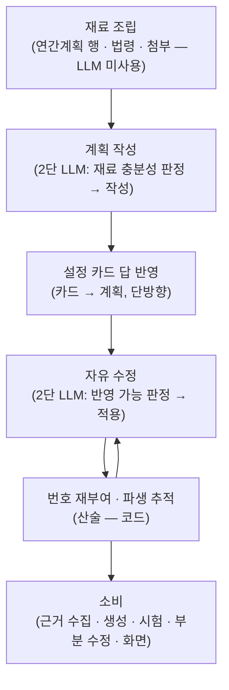

# 교육자료 구성 계획 수립

**구성 계획**은 "**이 교육에서 무엇을 가르칠 것인가**"를 정의하는 데이터 구조이며, 이 탭의 모든
파이프라인이 참조하는 **단일 소스**입니다. 근거 수집, 자료 생성, 시험 출제, 부분 수정, 화면
표시가 모두 이 구조 하나를 읽습니다.

구성 계획은 다음 요소로 구성됩니다.

| 구성 요소 | 내용 |
|---|---|
| 교육 정보 | 교육 제목, 회차, 교육시간 |
| 교시별 구성 | 교시 제목, 다룰 주제, 분량(쪽), 사진 상한 |
| 담당자 요구사항 | 회차 전체 또는 교시 단위로 남긴 자연어 요구 |
| 생성 설정 | 문서 형태, 생성 단위, 난이도, 구성 방식, 요약본, 근거 범위 |

이 중 교시별 구성이 "무엇을 가르칠 것인가"를 정한다면, 함께 저장되는 [생성
설정](./settings.md)은 그 내용을 "어떤 형태와 방식으로 만들 것인가"를 정합니다.

## 설계 규칙

구성 계획의 일관성은 세 가지 규칙으로 유지됩니다.

**수정 경로 단일화.** 계획의 구조를 만들고 고치는 판단 코드는 계획 패키지 내부에만
존재합니다. 소비 측(근거 수집·생성·시험·화면)은 **읽기 전용**이며 판정·보정을 하지 않습니다.
담당자가 직접 지정한 값(교시 분량, 사진 상한, 근거 범위)을 계획의 해당 필드에 옮겨 적는
운반은 대화 도구가 수행하되, 판단은 포함하지 않습니다.

**LLM 입력 텍스트의 단일화.** 계획 수정 LLM의 입력과 대화 LLM의 상태 요약에 실리는 계획
텍스트는 **동일한 렌더 함수의 출력**입니다. 두 호출이 서로 다른 형태로 계획을 읽으면 같은
계획에 대해 다른 이해를 갖게 되기 때문입니다. 담당자 화면의 계획 블록은 별도 렌더러가
같은 계획 객체를 읽어 그립니다.

**원본 불변.** 계획 조립 시 조회한 연간계획 행 원문은 별도 보관되며 수정되지 않습니다.
담당자의 수정은 구성 계획에만 반영되므로, 원래 계획과의 차이를 언제든 원본과 대조할 수
있습니다.

## 수명주기



**재료 조립.** 교육이 선택되면 백엔드에서 해당 교육의 연간계획 행, 교육과정 정보, 법령
근거를 조회해 재료로 구성합니다. 이 단계는 LLM 없이 코드가 수행합니다. 즉석 주제 또는
첨부 문서 기반으로 시작하는 경우 그에 해당하는 재료가 대신 구성됩니다.

**계획 작성 — 2단 LLM.** 1차 호출이 현재 재료만으로 계획 작성이 가능한지 판정하고,
부족한 경우 검색 질의를 생성해 사내 문서 후보를 보강합니다. 2차 호출이 재료를 바탕으로
교시 구성 초안을 작성합니다. 두 호출로 분리한 것은 기술 제약 때문입니다 — 구조화된
출력을 강제하는 호출에는 **검색 도구를 함께 연결할 수 없습니다**. 초안 완성 후, 시스템이
이미 보유한 값(제목·회차·교육시간)은 **LLM 출력을 사용하지 않고** 코드가 채웁니다.

**설정 카드 답 반영 — 단방향.** 질문 카드의 답변(문서 형태·난이도·분량 등)은 계획으로
이동한 뒤 계획에서만 읽습니다. 계획 값을 카드에 반영하는 역방향 코드는 존재하지 않으며,
추가해서도 안 됩니다 — 대화로 변경한 값이 카드의 이전 답변으로 되돌아가게 됩니다.

**자유 수정 — 2단 LLM.** "2교시를 둘로 나눠 줘"와 같은 요구는 1차 호출이 현재 계획과
재료로 반영 가능한지 판정한 뒤, 2차 호출이 계획 전체를 다시 작성하는 방식으로
적용합니다. 적용 호출은 대화 이력을 함께 받아 맥락 의존 지시("아까 말한 것")를
해소합니다. 반영에 실패한 경우 **계획을 변경하지 않고** 실패 사실을 보고합니다.

**번호 재부여·파생 추적 — 산술.** 수정으로 교시가 병합·분할되면 교시 번호는 배열
순서대로 코드가 재부여합니다. 각 교시에는 수정 전 어느 교시에서 파생되었는지가 한
세대만 기록되며, 근거 수집이 기존 근거를 새 교시 번호로 승계하는 데 사용합니다. 이
기록은 **승계 직후 제거됩니다** — 유지하면 다음 수정 시 이전 세대의 번호가 섞여 근거가
잘못된 교시로 승계됩니다.

**소비.** 근거 수집은 교시별 주제를 검색 질의 재료로 읽고, 생성은 설정과 교시 구성·
쪽수를 읽고, 시험은 교시 구성과 요구사항을 읽고, 화면은 계획 블록을 렌더합니다. 자료
생성 이후의 부분 수정은 **계획을 변경하지 않습니다** — 산출물 위의 수정은 "무엇을
가르칠지"의 변경이 아니기 때문입니다.

## 화면에 표시되는 형태

담당자에게 제시되는 구성 계획 블록의 모양입니다(가공 예시). 참고 근거 목록이 함께
표시되며, 채택된 근거는 생성되는 모든 페이지에 출처로 연결됩니다.

```markdown
**밀폐공간 작업 안전 — 교육자료 구성 계획** (2교시)

**1교시 · 밀폐공간의 위험과 사전 확인** · 50분 · 지정 12페이지
- 밀폐공간의 정의와 대상 작업
- 산소농도·유해가스 측정
- 작업 전 허가 절차

**2교시 · 작업 중 안전수칙과 비상대응** · 50분
- 감시인 배치와 통신 유지
- 비상시 구조 절차

이 구성으로 진행해도 될까요? 추가로 반영할 내용이 있으면 말씀해 주세요.

---
**참고 근거** — 생성되는 모든 페이지에 [출처]로 연결됩니다
- 법령: 산업안전보건기준에 관한 규칙(밀폐공간 작업)
- 1교시: 밀폐공간 질식재해 예방 가이드 · 작업허가 절차 안내
- 2교시: 밀폐공간 구조 훈련 자료
```

## 데이터 구조

계획 본체, 교시, 생성 설정의 세 층으로 구성됩니다. 필드별 정의는 스키마 파일에 LLM이
읽는 필드 설명으로 작성되어 있으며, 정확한 계약은 스키마 파일이 기준입니다.

**계획 본체**

| 필드 | 정의 |
|---|---|
| `title` | 교육 제목. 복수 회차 중 하나인 경우 회차 표기가 붙음 |
| `edu_ref` | 출처 교육과정 식별 정보(과정번호·교육명) |
| `round_no` / `planned_hours` | 회차 번호, 계획된 교육시간 |
| `source` | 계획 서술의 출처 구분 — 연간계획 원문 기반 / 옮겨 적음 / 신규 구성 |
| `syllabus_notes` / `extra_syllabus_notes` | 회차 전체에 적용되는 담당자 요구 / 연간계획 원문의 기타 항목 |
| `settings` | 생성 설정 (아래 표) |
| `sessions` | 교시 목록 — 배열 순서가 교시 순서 |

**교시**

| 필드 | 정의 |
|---|---|
| `session_no` | 교시 번호 — 배열 순서 기준으로 코드가 재부여 |
| `session_title` / `topics` | 교시 제목, 다룰 주제 목록 |
| `pages` | 교시 분량(쪽) — 분량 값이 존재하는 유일한 위치 |
| `photos` | 사진 상한 — 0은 이미지 제외, 미지정은 제한 없음 |
| `minutes` | 표시용 시간 — 분량 판단에 사용하지 않음 |
| `session_notes` / `extra_session_notes` | 교시 단위 담당자 요구 / 원문의 기타 항목 |
| `from_sessions` | 수정 전 파생 원점 교시 — 근거 승계용, 한 세대만 유지 |

**생성 설정** — 전 필드가 미지정 상태를 허용하며, 미지정 시 소비 측이 기본값을 적용합니다.

| 필드 | 정의 |
|---|---|
| `template` | 문서 형태 — 세로형 문서 / 가로형 발표 자료 |
| `unit` | 생성 단위 — 회차 통합 문서 / 교시별 문서 |
| `level` | 난이도 — 동일 분량 내에서 다룰 내용의 수준 (분량 아님) |
| `style` | 구성 방식 — 강의식, 문답식, 사례 중심, 체크리스트 등 |
| `condensed_ratio` / `condensed_pages` | 요약본 분량 — 쪽수 지정이 비율보다 우선, 모두 미지정이면 요약본 미생성 |
| `evidence_scope` | 근거 범위 — 첨부 문서만 / 사내 문서 보강 |

시험 구성(문항 수·유형)은 구성 계획이 아니라 별도의 시험 구성 값에 저장됩니다.
[시험과 강의평가](./exam.md)에서 다룹니다.

## 코드 참조

| 구성 요소 | 코드 이름 | 모듈 경로 |
|---|---|---|
| 구성 계획 타입(세 층) | `Syllabus` / `SyllabusSession` / `GenerationSettings` | `src/schemas/syllabus.py` |
| 계획 패키지 | — | `src/tabs/edu_material/syllabus/` |
| 재료 조립 | `AnnualPlanLoader` | `src/tabs/edu_material/syllabus/load_annual_plan.py` |
| 계획 작성 | `SyllabusBuilder` | `src/tabs/edu_material/syllabus/build_syllabus.py` |
| 자유 수정 | `SyllabusReviser` | `src/tabs/edu_material/syllabus/apply_request.py` |
| 카드 답 반영 | `apply_card_answers` | `src/tabs/edu_material/syllabus/settings_sync.py` |
| 번호 재부여·파생 추적 | `renumber_sessions` 외 | `src/tabs/edu_material/syllabus/renumber.py` |
| LLM 입력용 계획 렌더 | `render_syllabus` | `src/tabs/edu_material/syllabus/apply_request.py` |
| 화면용 계획 블록 렌더 | `render_plan_block` | `src/tabs/edu_material/syllabus/render_block.py` |
| 연간계획 원본(불변) | `annual_source_plan` | `src/schemas/education_content.py` |
