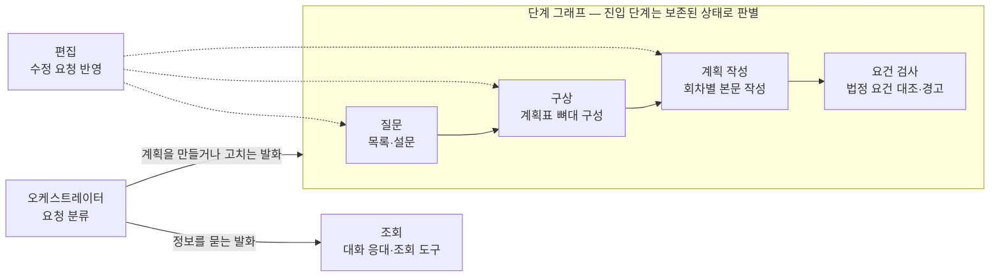

# 연간 교육계획 에이전트 지도

연간 교육계획 탭은 요청을 분류하는 오케스트레이터와 여섯 에이전트로 구성됩니다. 이
페이지는 각 에이전트가 **소유하는 결정**, 쓰는 프롬프트, 읽고 쓰는 세션 상태를 한 표로
정리하고, 한 곳을 고칠 때 함께 봐야 하는 자리를 안내합니다. 담당자 관점의 작업 흐름은
[연간 교육계획 수립하기](../annual-plan/intro.md) 장이 다루며, 이 페이지는 코드를 여는
사람의 관점입니다.

## 구성

에이전트는 세 부류입니다. 오케스트레이터가 턴의 첫 단계에서 발화를 가르고, 단계
에이전트 넷(질문·구상·계획 작성·요건 검사)이 워크플로 순서대로 작업을 맡으며, 편집
에이전트와 조회 에이전트는 순서에 들어가지 않는 부품입니다. 편집 에이전트는 질문·구상·계획
작성 에이전트가 각자 호출하고, 조회 에이전트는 정보를 묻는 발화만 받습니다.

## 소유 범위

읽는 상태·쓰는 상태의 이름은 [상태와 세션](../concepts/state.md)의 연간 탭 필드와
같습니다. 턴 내부 신호는 화면 컨텍스트에 실려 그 턴 안에서만 유효한 값입니다([API
계약](../reference/api.md)의 내부 전용 키).

| 에이전트 | 소유하는 결정 | 프롬프트 | 읽는 상태 | 쓰는 상태 |
|---|---|---|---|---|
| 오케스트레이터 | 발화의 세 갈래 분류(작업·조회·범위 밖), 재시작 신호, 범위 밖 발화의 거절 안내, 물음과 변경이 섞인 발화의 관찰(미반영 고지의 재료) | 분류, 거절 안내 | 대화 이력, 대기 상태, 설문 시트의 단계, 되물음 목록 | 이번 턴 경로, 대화 이력, 턴 내부 신호(재시작·미반영 고지). 재시작이면 설문 시트·계획 기준선·연간 계획을 비움 |
| 질문 | 진입 판정(결재 완료 차단·저장된 계획 복원·일괄 생성 분기), 교육 목록의 세 갈래와 조정, 설문 여덟 문항과 기본값 진행, 시간이 확인되지 않는 교육의 처리 질문 | 법정 시간 추출 | 화면 컨텍스트(부서·연도), 설문 시트 | 설문 시트, 대기 상태, 대화 이력. 저장된 계획을 복원한 턴에는 계획 기준선·연간 계획도 함께, 턴 내부 신호(복원 직후) |
| 편집 | 발화를 결정 상태에 반영 — 값·구성·메모, 총칭의 화면 범위, 사람 지칭의 실명 해소, 진행 의사 관찰 | 결정 문서 편집 | 호출자가 만든 결정 문서와 화면 설명, 대화 이력 | 없음 — 고쳐진 문서를 돌려주고 호출자가 옮겨 적으며 전후 비교 |
| 구상 | 계획표 조립(회차 골격·시간 배분·설문 답과 과정별 결정 적용), 실시월 배정(규칙 코드 또는 LLM), 회차별 주제 배분, 상태 파생 경고, 계획표 승인 게이트, 이 화면의 교육 추가·복원 완성 | 실시월 배정, 회차 주제 배분, 학습 주제 추출, 부서 특성 배정 | 설문 시트, 계획 기준선(확인 게이트 턴) | 계획 기준선, 대기 상태, 대화 이력. 확인 게이트 턴의 설문 답 변경은 설문 시트에도 |
| 계획 작성 | 회차별 교육 내용 본문 생성, 생성 후 수정(값 동기·구성 변경의 부분 생성·내용 재작성), 시간이 빈 교육의 되물음 | 회차 내용 작성 | 계획 기준선, 연간 계획, 설문 시트, 턴 내부 신호(복원 직후) | 연간 계획, 계획 기준선, 되물음 목록, 대기 상태, 대화 이력, 턴 내부 신호(무변경·이번 턴 변경). 다른 단계 질문의 답이 함께 오면 설문 시트도 |
| 요건 검사 | 대화 맥락을 아는 검토 — 담당자가 시킨 변경은 다시 짚지 않고, 의도하지 않았을 문제만 소수로 | 계획 검토 | 계획 기준선, 연간 계획, 대화 이력, 턴 내부 신호(이번 턴 변경) | 요건 검사 결과, 대화 이력, 대기 상태 해제 |
| 조회 | 정보 질문 응대 — 세션이 들고 있는 현재 계획을 기준으로 답하고, 필요할 때만 조회 도구 호출 | 연간 탭 매뉴얼 | 대화 이력, 이전 턴의 조회 결과, 현재 상태 요약(계획표·경고·설문 답) | 조회 결과 누적 기록, 대화 이력 |

조회 에이전트가 쥐는 도구는 교육 데이터 조회 도구 전부와, 세션에서 생성한 본문이 있을
때 추가되는 본문 조회 도구입니다. 계획을 고치는 도구는 없습니다. 조회 응대 뒤에 진행
중이던 화면을 다시 제시하고 미반영 고지를 붙이는 것은 에이전트가 아니라 그래프 배선의
노드입니다 — 오케스트레이터가 남긴 관찰 신호와 질문·구상 에이전트의 화면 렌더를 그대로
씁니다.

## 함께 고쳐야 하는 묶음

한 에이전트의 파일만 고치면 오류 없이 값이 어긋나는 자리입니다. 각 묶음의 자세한
설명은 정본 페이지로 연결합니다.

| 바꾸는 것 | 함께 보는 자리 | 정본 |
|---|---|---|
| 설문 질문·보기·기본값 | 구상 에이전트의 답 적용, 일괄 생성 답안, 편집 프롬프트의 답 기록 규칙, 설문 고정 테스트 | [기능 추가 가이드](./extension.md)의 설문 질문·보기 수정 |
| 실시월 배정 규칙 문구 | 배정 프롬프트, 편집 프롬프트의 화면 조정 문장, 버튼 답 경로의 규칙 코드 | [기능 추가 가이드](./extension.md)의 실시월 배정 규칙 수정 |
| 편집 프롬프트가 가르치는 출력 형태 | 결정 문서를 옮겨 적는 병합 규칙 | [프롬프트와 설정 수정](./prompts-and-settings.md) |
| 상태 파생 경고의 판정·문구 | 계획표 제시, 요건 검사 결과, 저장된 계획 복원 제시, 조회 응대와 추천 문구가 받는 상태 요약 — 네 화면이 한 함수를 공유 | [연간 계획표 확인](../annual-plan/plan-table.md)의 경고 |
| 조회 응대가 받는 상태 요약 | 추천 문구 에이전트와 같은 함수 — 한쪽만 고치면 두 결과가 갈림 | [계획 수정과 조회](../annual-plan/revision.md)의 계획의 조회 |
| 편집 에이전트를 부르는 세 자리의 화면 설명 | 화면에 보이는 교육의 구분과 본문 생성 여부를 밝혀야 총칭의 범위와 내용 수정 판정이 맞음 | [대화 반영 방식](../annual-plan/edits.md) |
| 단계 그래프의 노드 이름 | 진행 상태 라벨 표 — 노드 이름이 키 | [엔드포인트](../reference/endpoints.md)의 진행 상태 조회 |
| 계획 작성 에이전트의 이번 턴 변경 신호 | 요건 검사가 재지적 금지의 근거로 읽음 — 신호가 빠지면 검사가 변경 없는 턴으로 오해 | [요건 검사](../annual-plan/verification.md) |

## 코드 참조

| 구성 요소 | 코드 이름 | 모듈 경로 |
|---|---|---|
| 오케스트레이터 | `AnnualRouterAgent` | `src/tabs/annual_plan/router/agent.py` |
| 조회 뒤 화면 재제시·미반영 고지 | `resume_gate` | `src/tabs/annual_plan/graph.py` |
| 질문 에이전트 | `IntakeAgent` | `src/tabs/annual_plan/intake/agent.py` |
| 편집 에이전트 | `PlanEditorAgent` | `src/tabs/annual_plan/editor/agent.py` |
| 결정 문서 옮겨 적기·전후 비교 | `merge_into_sheet` / `merge_into_checklist` | `src/tabs/annual_plan/editor/projection.py` |
| 구상 에이전트 | `PlanTableAgent` | `src/tabs/annual_plan/plan_table/agent.py` |
| 상태 파생 경고 | `plan_warning_block` | `src/tabs/annual_plan/plan_table/agent.py` |
| 실시월 배정 규칙 문구·규칙 코드 | `MONTH_RULES` / `assign_months` | `src/tabs/annual_plan/plan_table/schedule_rules.py` |
| 계획 작성 에이전트 | `PlanWriterAgent` | `src/tabs/annual_plan/plan_writer/agent.py` |
| 요건 검사 에이전트 | `PlanCheckerAgent` | `src/tabs/annual_plan/checker/agent.py` |
| 조회 에이전트 | `InquiryAgent` | `src/tabs/annual_plan/inquiry/agent.py` |
| 상태 요약(조회 응대·추천 문구 공용) | `_annual_caps` | `src/agents/suggester/agent.py` |
| 진행 상태 라벨 표 | `LABELS` / `EXEC_NODES` | `src/api/progress.py` |
