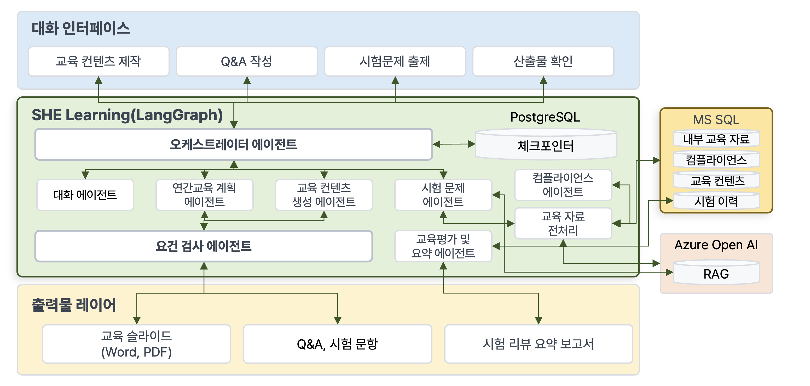
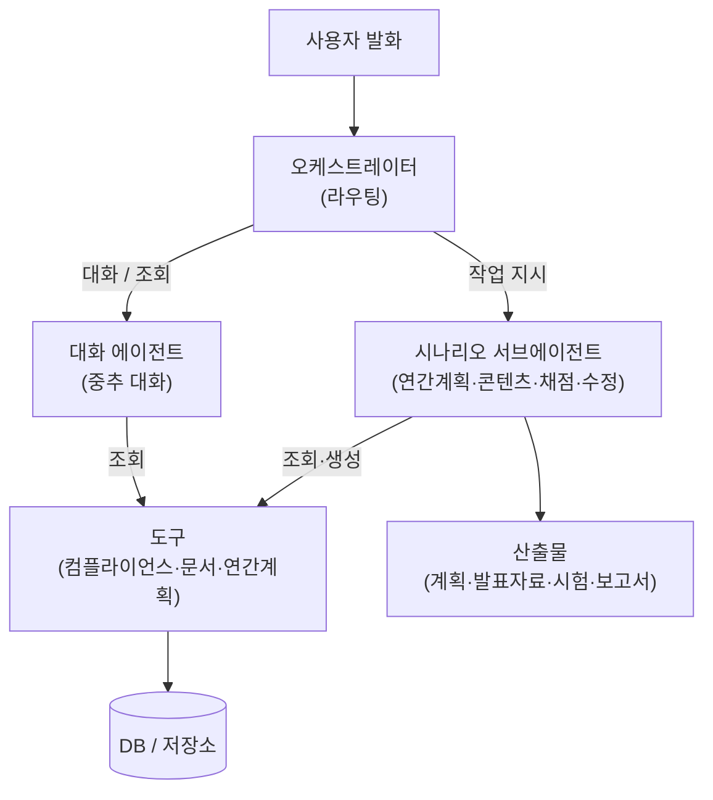

# 개요

> 대화 계층(**오케스트레이터 + 대화 에이전트**)이 중추이고, 그 아래로 **도구**(데이터 조회)와 **시나리오 서브에이전트**(무거운 작업)를 호출합니다.

교육 자동화 AI 에이전트 시스템입니다. 하나의 LangGraph 부모 그래프로 동작하며, 매 턴 입구는 **오케스트레이터**입니다. 거기서 대화로 답하거나(대화 에이전트) 작업 시나리오로 보냅니다(서브에이전트). 데이터는 항상 **도구**를 통해서만 접근합니다.

## 계층 {#layers}

| 계층 | 역할 |
| :-- | :-- |
| **오케스트레이터** | 매 턴 발화를 분류해 대화/작업으로 **라우팅**. 직접 일하지 않음 |
| **대화 에이전트** | 질문·조회·확인에 답하는 **중추 대화**. 읽기 전용, 조회 도구 사용 |
| **시나리오 서브에이전트** | 무거운 **작업**(연간계획·콘텐츠 생성·채점/결과·수정). 각자 LangGraph 서브그래프 |
| **도구** | 데이터 접근의 **유일한 통로**(자유 SQL·자율 탐색 금지). 컴플라이언스·문서·연간계획 조회 |

## 왜 이렇게 {#why}

- **오케스트레이터 + 대화가 중추**: 사용자와의 모든 턴은 이 둘을 거칩니다. 가벼운 건 대화 에이전트가 즉시 답하고, 무거운 작업만 시나리오 서브에이전트로 내려보냅니다.
- **도구가 데이터 경계**: 에이전트(LLM)는 테이블/SQL을 직접 보지 않고, 정의된 조회 도구의 **조립된 결과**만 받습니다. 그래서 스키마가 평탄하든 정규화든 에이전트는 영향받지 않고, 실제 외부 DB로 교체해도 도구 내부만 바뀝니다.
- **시나리오는 결정론 서브그래프**: 권한·게이트·순서처럼 신뢰가 필요한 부분은 코드(그래프)가 쥐고, LLM은 생성·판단만 맡습니다.

## 관련 문서 {#see-also}

* [오케스트레이터](./agents/orchestrator.md) · [대화 에이전트](./agents/conversation.md)
* [에이전트 플로우](./scenarios/agent-flow.md) — 시나리오별 데이터 참조 흐름
* [레포 구조](./repo-structure.md) · [컴플라이언스 DB](./data/compliance-db.md)
