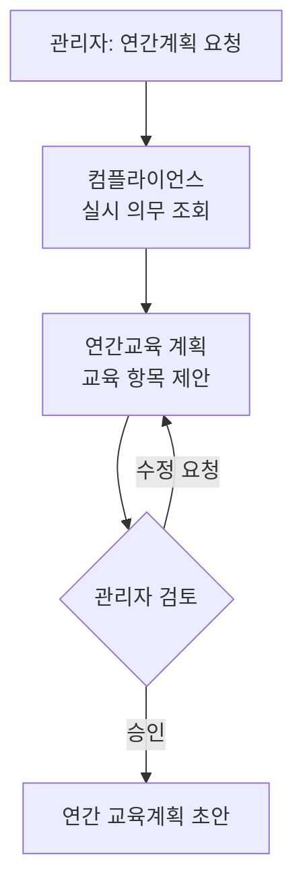

# 연간 교육계획 수립

> 관리자와 대화하며 한 해의 교육 커리큘럼을 설계하는 흐름을 다룹니다.

관리자가 대상 팀과 연도를 정해 연간 교육계획을 요청하면, 시스템은 그 팀이 실시해야 할 교육 의무를 [컴플라이언스 DB](../data/compliance-db.md)에서 조회해 교육 항목을 제안합니다. 관리자는 제안을 보고 항목을 더하거나 빼고 강사·시간·방법을 조정하며, 이 과정을 여러 차례 거쳐 계획을 다듬습니다. 관리자가 승인하면 연간 교육계획 초안이 완성됩니다.

* [개요](#overview)
* [처리 흐름](#flow)
* [데이터 흐름](#data)

## 개요 {#overview}

| 항목 | 내용 |
| :-- | :-- |
| 트리거 | "올해 교육계획 짜줘" 등 커리큘럼 설계 요청 |
| 입력 | 대상 팀(조직), 계획 연도 |
| 참여 에이전트 | 대화 · 컴플라이언스 · 연간교육 계획 |
| 산출물 | 연간 교육계획 초안 |

## 처리 흐름 {#flow}

1. **실시 의무 조회** — [컴플라이언스 에이전트](../agents/compliance.md)가 [컴플라이언스 DB](../data/compliance-db.md)에서 그 팀이 실시해야 할 교육 목록과 주기·법정시간·근거를 조회합니다. 교육자료 저장소는 쓰지 않습니다.
2. **교육 항목 제안** — [연간교육 계획 에이전트](../agents/annual_plan.md)가 의무를 교육 항목으로 펼치고, 각 항목에 대상자군·교육 분류·근거·시간·방법·평가 방법을 채워 제안합니다.
3. **대화로 다듬기** — 관리자 피드백(항목 추가·삭제, 분량 조정, 방법 변경)을 반영해 계획을 갱신합니다. 한 대화 턴이 한 호출이며 여러 턴에 걸쳐 수렴합니다. 미정 값(강사·시간)은 되물음으로 묻습니다.
4. **승인** — 관리자가 승인하면 종료합니다.

## 데이터 흐름 {#data}

| 단계 | 에이전트 | 입력 | 출력 | 도구 |
| :-- | :-- | :-- | :-- | :-- |
| 의무 조회 | 컴플라이언스 | 대상 팀 | 실시 의무(`requirements`) | `sql_query_tool` |
| 항목 제안·개정 | 연간교육 계획 | 실시 의무, 관리자 발화, 직전 계획 | 계획 초안(`draftPlan`) | `llm` |

각 항목의 근거는 조회한 실시 의무에서 연결합니다. 별도 문서 검색은 하지 않습니다.

:::note[설계 메모]

- 미정 값(강사·시간)은 정상이며, 되물음으로 다음 턴에 채웁니다.
- 종료는 관리자 승인 시점입니다. 결재(팀장·본부장)는 이 흐름 밖이며 백엔드가 담당합니다.
- 완성된 계획은 교육 콘텐츠 생성의 컨텍스트로 넘길 수 있습니다.

:::

## 관련 문서 {#see-also}

* [에이전트 플로우](./agent-flow.md) — 시나리오 개요
* [컴플라이언스 에이전트](../agents/compliance.md) · [연간교육 계획 에이전트](../agents/annual_plan.md)
* [교육 콘텐츠 생성](./content-generation.md)
