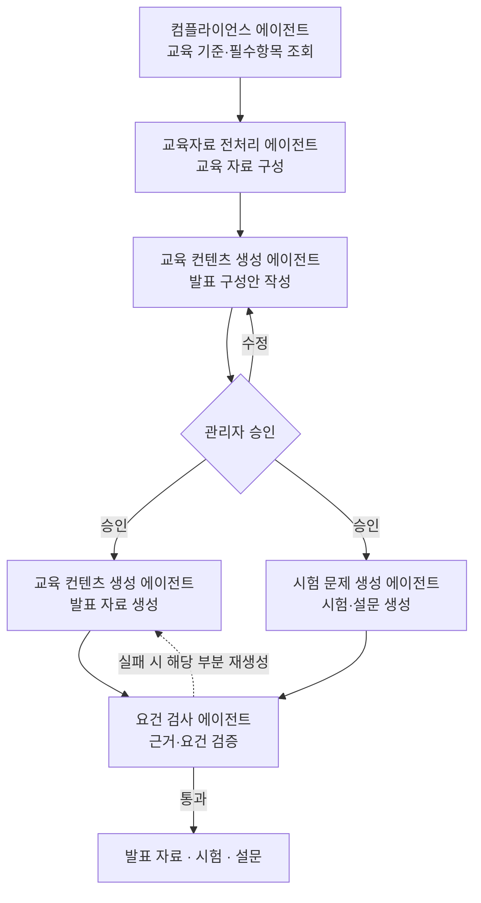

# 교육 콘텐츠 생성

> 한 교육의 발표 자료·시험·강의평가 설문을 만드는 흐름을 다룹니다.

관리자가 특정 교육의 콘텐츠를 요청하면, 시스템은 그 교육이 다뤄야 할 필수항목을 [컴플라이언스 DB](../data/compliance-db.md)에서 조회하고, [교육자료 저장소](../data/content-repository.md)에서 내용을 모아 교육 자료를 구성합니다. 이어 발표 구성안을 만들어 관리자 승인을 받고, 승인된 구성안으로 발표 자료와 시험·설문을 생성한 뒤 근거와 요건 충족 여부를 검증합니다.

* [개요](#overview)
* [처리 흐름](#flow)
* [데이터 흐름](#data)
* [산출물](#output)

## 개요 {#overview}

| 항목 | 내용 |
| :-- | :-- |
| 트리거 | "○○ 교육자료·시험 만들어" |
| 입력 | 대상 교육, NData 로드맵, (있으면) 연간계획 컨텍스트 |
| 참여 에이전트 | 컴플라이언스 · 교육자료 전처리 · 교육 컨텐츠 생성 · 시험 문제 생성 · 요건 검사 |
| 산출물 | 발표 자료 · 시험 · 강의평가 설문 |

## 처리 흐름 {#flow}

1. **기준 조회** : [컴플라이언스 에이전트](../agents/compliance.md)가 그 교육의 필수항목·구분·시험유형·근거를 조회합니다.
2. **교육 자료 구성** : [교육자료 전처리 에이전트](../agents/content_preprocess.md)가 [교육자료 저장소](../data/content-repository.md)의 라우터 레이어에서 문서 범위를 받아, 그 안에서 필수항목별 내용을 모아 교육 자료를 구성합니다.
3. **구성안 작성** : [교육 컨텐츠 생성 에이전트](../agents/content_generation.md)가 교육 자료로 목차·평가·설문 구성안을 만듭니다.
4. **승인** : 구성안을 관리자가 승인합니다. 승인 전에는 다음 단계로 넘어가지 않습니다.
5. **생성(병렬)** : 승인된 구성안으로 교육 컨텐츠 생성 에이전트가 발표 자료를, [시험 문제 생성 에이전트](../agents/exam_generation.md)가 시험과 강의평가 설문을 생성합니다. 발표 자료는 NData HTML 템플릿에 채웁니다.
6. **검증** : [요건 검사 에이전트](../agents/requirement_check.md)가 근거 연결과 요건 충족을 검사합니다. 어긋나면 해당 부분만 다시 생성합니다.

## 데이터 흐름 {#data}

| 단계 | 에이전트 | 입력 | 출력 | 도구 |
| :-- | :-- | :-- | :-- | :-- |
| 기준 조회 | 컴플라이언스 | 대상 교육 | 교육 기준(`requirements`) | `sql_query_tool` |
| 교육 자료 | 교육자료 전처리 | 교육 기준 | 교육 자료(`educationMaterial`) | `document_fetch_tool` · `vector_search_tool` |
| 구성안 | 교육 컨텐츠 생성 | 교육 자료 | 구성안(`plan`) | — |
| 발표 자료 | 교육 컨텐츠 생성 | 구성안, 교육 자료 | 발표 자료(`presentation`) | — |
| 시험·설문 | 시험 문제 생성 | 구성안, 교육 자료 | 시험(`exam`), 설문(`survey`) | — |
| 검증 | 요건 검사 | 발표 자료, 시험, 설문, 교육 기준 | 검증 결과(`verification`) | — |

## 산출물 {#output}

- **발표 자료** : NData HTML 템플릿에 채운 발표 콘텐츠. 각 섹션은 교육 자료의 근거를 승계합니다.
- **시험** : 문항·정답·해설·근거. 문항 유형은 객관식·OX·서술 등 다양합니다.
- **강의평가 설문** : 교육에 대한 피드백 설문. 시험과 별개입니다.

:::note[설계 메모]

- 교육 자료(`educationMaterial`)와 발표 자료(`presentation`)는 다른 산출물입니다.
- 평가를 필기시험으로 단정하지 않습니다. 교육 유형(교육·훈련)에 따라 형태가 갈립니다.
- 근거 연결은 자료 구성부터 생성까지 전 단계를 관통합니다.

:::

## 관련 문서 {#see-also}

* [에이전트 플로우](./agent-flow.md) — 시나리오 개요
* [컴플라이언스](../agents/compliance.md) · [교육자료 전처리](../agents/content_preprocess.md) · [교육 컨텐츠 생성](../agents/content_generation.md) · [시험 문제 생성](../agents/exam_generation.md) · [요건 검사](../agents/requirement_check.md)
* [수정과 재생성](./revision.md)
