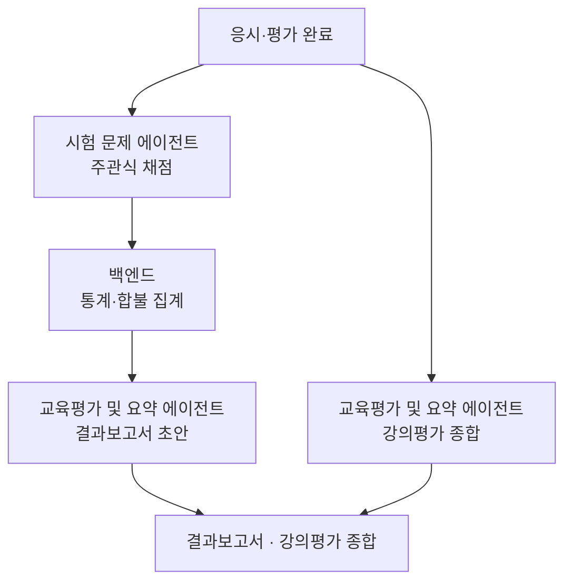

# 채점과 결과보고서

> 응시 답안을 채점하고 결과보고서와 강의평가 종합을 작성하는 흐름을 다룹니다.

교육의 응시와 평가가 끝나면, 시스템은 주관식 답안을 채점하고, 백엔드가 집계한 통계로 결과보고서 초안을 쓰고, 수강자 후기를 종합합니다. 세 가지는 부분적으로 독립된 작업이며, 같은 교육을 기준으로 묶입니다.

* [개요](#overview)
* [처리 흐름](#flow)
* [데이터 흐름](#data)
* [산출물](#output)

## 개요 {#overview}

| 항목 | 내용 |
| :-- | :-- |
| 트리거 | 응시·평가 완료 또는 "○○ 교육 결과 정리해" |
| 입력 | 시험지·응시 답안·채점 기준(채점), 백엔드 통계·미이수자·합불(보고서), 수강자 후기(강의평가) |
| 참여 에이전트 | 시험 문제 · 교육평가 및 요약 · 대화 |
| 산출물 | 채점 결과 · 결과보고서 초안 · 강의평가 종합 |

## 처리 흐름 {#flow}

1. **채점** : [시험 문제 에이전트](../agents/exam_generation.md)가 주관식 답안을 채점합니다. 객관식·OX는 백엔드 규칙으로 자동 채점하므로 이 단계에서 건너뜁니다. 합불·총점 판정도 백엔드가 합니다.
2. **결과보고서 초안** : 채점이 끝나고 백엔드가 총점·합불을 확정하면, [교육평가 및 요약 에이전트](../agents/eval_survey_summary.md)가 그 통계로 결과보고서를 서술합니다. 개인 결과가 아니라 관리자용 집단 통계(점수 분포·합격률·미이수 현황)입니다.
3. **강의평가 종합** : 교육평가 및 요약 에이전트가 수강자 후기(별점·자유 서술)를 종합해 요약·키워드·대표 인용을 만듭니다. 채점과 별개 작업입니다.

## 데이터 흐름 {#data}

| 단계 | 에이전트 | 입력 | 출력 | 도구 |
| :-- | :-- | :-- | :-- | :-- |
| 채점 | 시험 문제 | 응시 답안, 문항 정의 | 채점 결과(`grading`) | — |
| 결과보고서 | 교육평가 및 요약 | 백엔드 통계, 미이수자, 합불 | 결과보고서 초안(`resultReport`) | — |
| 강의평가 종합 | 교육평가 및 요약 | 수강자 후기 | 강의평가 종합(`reviewSummary`) | — |

통계 수치·합불·미이수 판정은 백엔드가 산출하고, 이 흐름은 받은 값을 서술합니다.

## 산출물 {#output}

- **채점 결과** : 주관식 항목의 점수와 채점 근거. 백엔드 답안 레코드에는 점수와 채점 주체만 회신합니다.
- **결과보고서 초안** : 관리자용 집단 통계 서술. 배포 전 관리자 확인을 거칩니다.
- **강의평가 종합** : 후기 요약·키워드·만족도 경향.

:::note[설계 메모]

- 시험과 강의평가는 다릅니다. 시험은 수강자 지식을 채점하고, 강의평가는 교육 자체에 대한 피드백을 종합합니다(채점 없음).
- 채점은 평가 방법이 필기시험일 때만 있습니다. 실습·면담 등은 채점 단계가 비어 있습니다.
- 신뢰도가 낮은 주관식 채점은 사람 검토 대상으로 표시합니다.

:::

## 관련 문서 {#see-also}

* [에이전트 플로우](./agent-flow.md) : 시나리오 개요
* [시험 문제 에이전트](../agents/exam_generation.md) · [교육평가 및 요약 에이전트](../agents/eval_survey_summary.md)
* [교육 콘텐츠 생성](./content-generation.md)
