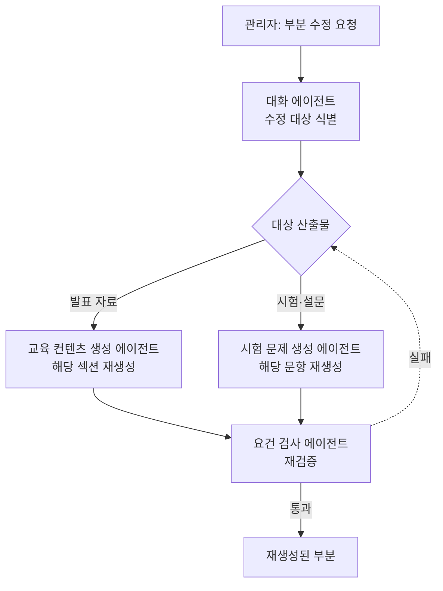

# 수정과 재생성

> 이미 생성한 콘텐츠의 일부를 다시 만드는 흐름을 다룹니다.

관리자가 "슬라이드 3만 다시 써줘", "이 문항 난이도를 올려줘"처럼 산출물 일부의 수정을 요청하면, 시스템은 대상을 식별해 해당 부분만 다시 생성하고 검증합니다. 대상은 교육 콘텐츠 생성이 만든 산출물(발표 자료·시험·설문)로 한정합니다.

* [개요](#overview)
* [처리 흐름](#flow)
* [데이터 흐름](#data)

## 개요 {#overview}

| 항목 | 내용 |
| :-- | :-- |
| 트리거 | "슬라이드 3만 다시", "이 문항 바꿔" 등 부분 수정 요청 |
| 입력 | 수정 대상(어느 산출물의 어느 부분), 현재 산출물, 수정 지시 |
| 참여 에이전트 | 대화 · 교육 컨텐츠 생성 · 시험 문제 생성 · 요건 검사 |
| 산출물 | 재생성된 부분 산출물 |

## 처리 흐름 {#flow}

1. **대상 식별** : [대화 에이전트](../agents/dialog.md)가 수정 지시를 읽어 어느 산출물의 어느 부분을 고칠지 식별합니다. 대상이 콘텐츠 생성 산출물이 아니면(연간계획·결과보고서 등) 이 흐름이 아니라 알맞은 곳으로 보냅니다.
2. **부분 재생성** : 대상이 발표 자료면 [교육 컨텐츠 생성 에이전트](../agents/content_generation.md)가, 시험·설문이면 [시험 문제 생성 에이전트](../agents/exam_generation.md)가 해당 부분만 다시 생성합니다. 나머지 부분과 식별자는 그대로 둡니다. 구성안과 교육 자료는 다시 만들지 않고 재사용합니다.
3. **재검증** : [요건 검사 에이전트](../agents/requirement_check.md)가 다시 만든 부분의 근거와 요건을 검사합니다. 어긋나면 다시 생성합니다.

## 데이터 흐름 {#data}

| 단계 | 에이전트 | 입력 | 출력 | 도구 |
| :-- | :-- | :-- | :-- | :-- |
| 대상 식별 | 대화 | 수정 지시, 현재 산출물 | 수정 요청(`revision`) | — |
| 부분 재생성 | 교육 컨텐츠 생성 / 시험 문제 생성 | 구성안, 교육 자료, 수정 요청, 현재 산출물 | 갱신된 부분 | — |
| 재검증 | 요건 검사 | 갱신된 산출물, 교육 기준 | 검증 결과(`verification`) | — |

## 산출물 {#output}

대상으로 지정한 부분만 다시 생성한 산출물입니다. 보존된 부분의 식별자는 바뀌지 않습니다. 재생성물도 초안이므로 배포 전 관리자가 확인합니다.

:::note[설계 메모]

- 대상은 교육 콘텐츠 생성 산출물(발표 자료·시험·설문)로 한정합니다. 연간계획·결과보고서 수정은 각 흐름의 승인 단계에서 처리합니다.
- 구성안 자체를 바꾸는 요청(목차 변경 등)은 부분 재생성이 아니라 구성안 재작성이며, 콘텐츠 생성의 구성안 단계로 돌아갑니다.
- 관리자의 직접 텍스트 편집은 NData 웹 UI가 담당하며 이 흐름 밖입니다.

:::

## 관련 문서 {#see-also}

* [에이전트 플로우](./agent-flow.md) — 시나리오 개요
* [교육 콘텐츠 생성](./content-generation.md) — 수정 대상을 만든 흐름
* [교육 컨텐츠 생성 에이전트](../agents/content_generation.md) · [시험 문제 생성 에이전트](../agents/exam_generation.md) · [요건 검사 에이전트](../agents/requirement_check.md)
